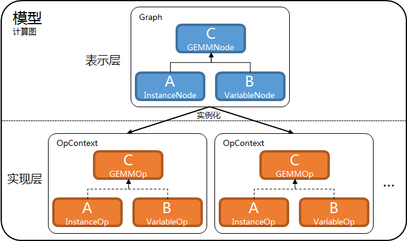

# 计算图

[TOC]

计算图在实现上分2层.

- 表示层.
  - Graph.
    - 主要由**节点**(GraphNode的子类)组成.
    - 表示节点连接关系.
- 实现层.
  - OpContext.
    - 主要由**算子**(Op的子类)组成.
    - 进行实际的计算.



## 表示层

Graph是表示层的核心数据结构, 它主要由节点组成.

### 表示层开发

所谓"开发模型", 主要是开发表示层, 即像搭积木一样搭出表示层.

表示层开发要确定.

- 网络结构.
- 用于离线训练的损失函数目标.
- 用于离线预测的目标(可选).
- 用于在线推理的目标(可选).

内置节点的使用参考[算子使用手册](op_manual.md).

内置节点可以满足绝大部分需求. 如果无法满足, 需要开发新节点, 参考[算子开发](op_dev.md).

#### 形状推理

表示层具有形状推理(shape inference)能力, 即给定节点和它所有输入节点, 推理给定节点的形状.

不借助形状推理.

```c++
auto* lin = WideGroupEmbeddingLookup(...);
auto* quad = DeepGroupEmbeddingLookup(...);
auto* deep = StackedFullyConnect(...);
auto* Z1 = Concat("Z1", {lin, quad, deep});
// 手动推理lin, quad, deep的形状.
int lin_col = ...;
int quad_col = ...;
int deep_col = ...;
// 手动推理Z1的形状.
int Z1_col = lin_col + quad_col + deep_col;
// 使用Z1的形状.
auto* W = GetVariable("W", Shape(Z1_col, 32), ...);
auto* Z2 = GEMM("Z2", Z1, W, 0, 0);
```

借助形状推理.

```c++
auto* lin = WideGroupEmbeddingLookup(...);
// lin->shape()可用.
auto* quad = DeepGroupEmbeddingLookup(...);
// quad->shape()可用.
auto* deep = StackedFullyConnect(...);
// deep->shape()可用.
auto* Z1 = Concat("Z1", {lin, quad, deep});
// Z1->shape()可用.
auto* W = GetVariable("W", Shape(Z1->shape()[1], 32), ...);
auto* Z2 = GEMM("Z2", Z1, W, 0, 0);
```

#### 例子

参考[排序模型的"model\_zoo"](../example/rank/model_zoo).

## 实现层

Graph和OpContext对应, 节点和算子对应.

节点表示计算, 算子进行计算.

- InstanceNode表示样本中的张量, InstanceOp获取并输出样本中的张量.
- VariableNode表示模型参数中的张量, VariableOp获取并输出模型参数中的张量.
- GEMMNode表示矩阵乘法, GEMMOp进行矩阵乘法.
- TransposeNode表示转置, TransposeOp进行转置.
- ...
