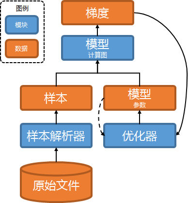
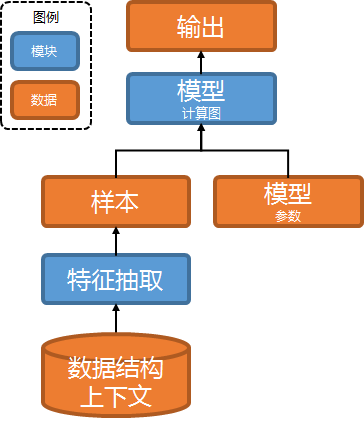

# 计算图引擎

[TOC]

本文档总体描述deepx的计算图引擎, 它是deepx中最重要的模块.

计算图引擎的典型应用是深度学习任务.

计算图引擎的头文件目录是["graph"](../include/deepx_core/graph).

## 应用构架

深度学习应用通常分2部分.

- 离线训练.
- 在线推理.

### 离线训练

离现训练的构架如下.

- 样本解析器.
  - 输入原始文件, 输出样本.
- 模型计算图, 以下以及在其它文档中均简称计算图.
  - 输入样本和模型参数, 通过前向/后向计算, 输出模型参数的梯度.
- 优化器.
  - 输入梯度, 更新模型参数和优化器参数.

和某些"任何操作皆算子"的框架不同, deepx的样本解析器和优化器是单独的模块.

### 在线推理

在线推理的构架如下.

- 特征抽取.
  - 输入在线数据结构和上下文, 输出样本.
- 计算图.
  - 输入样本和模型参数, 通过前向计算, 输出目标张量.

## 应用开发

一个完整的深度学习应用, 主要包含以下模块的开发或使用.

- 样本解析器.
  - 参考[张量](tensor.md).
  - 参考[样本解析器](instance_reader.md).
- 特征抽取.
  - deepx不提供特征抽取模块, 需要业务方开发.
  - 应尽量统一离线和在线的数据结构和代码, 保证样本解析器和特征抽取逻辑统一.
- 计算图.
  - 参考[张量](tensor.md).
  - 参考[计算图](graph.md).
  - 参考[算子使用手册](op_manual.md).
  - 参考[算子开发](op_dev.md).
- 优化器.
  - 参考[张量](tensor.md).
  - 参考[优化器](optimizer.md).
