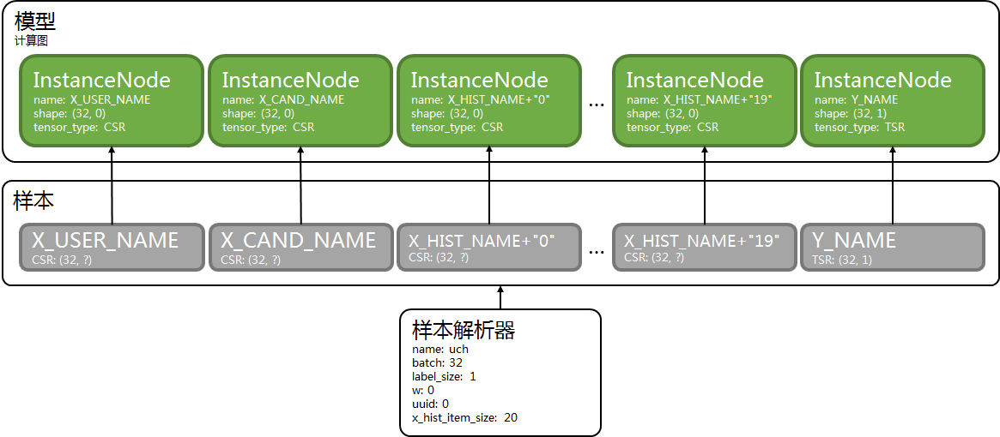

# 样本解析器

[TOC]

样本解析器是连接原始文件和计算图的桥梁, 它源源不断从原始文件解析出样本.

计算图中, InstanceNode表示样本中的张量.


本文档说明以下问题.

- 如何用样本表示输入数据.
- 内置样本解析器可以处理什么样的输入数据.
- 如果内置样本解析器无法满足需求, 如何开发样本解析器.

## 数据 -> 张量

样本是字符串到张量的映射表.

所以, 核心问题是"如何用张量表示各种输入数据".

下面是几种典型数据的张量表示方法. 这几种数据之间可以互相组合, 互相嵌套.

### 稀疏/离散数据

稀疏数据用CSR表示.

根据实际需要, 可以表示为1个或多个CSR.

### 分组稀疏/离散数据

1组稀疏数据对应1个特征组, 也叫特征域.

如果若干个特征组的数据一起做分组嵌入(GroupEmbeddingLookup, GroupEmbeddingLookup2), 那么将它们用1个CSR表示.

根据实际需要, 可以表示为1个或多个CSR.

### 稠密/连续数据

稠密数据用TSR表示.

根据实际需要, 可以表示为1个或多个TSR.

### 预训练嵌入(embedding)数据

预训练嵌入数据用TSR表示.

根据实际需要, 可以表示为1个或多个TSR.

### 序列数据

序列数据需要固定序列长度上限.

如果上限是n, 则用n个/组张量表示, 每个/组张量对应序列中某个时间点的数据.

### Pair-wise数据

Pair-wise数据用2个/组张量表示.

### 例子

某视频推荐任务中, 数据分以下几部分.

- 用户画像
- 上下文
- 候选视频
- 最近20个点击视频
- 最近20个观看视频

其中, 用户画像中包含离散数据, 嵌入数据(维度是m).

视频包含离散数据, 连续数据(维度是n), 嵌入数据(维度是k).

可以这样设计样本解析器的输出.

| 张量名称 | 张量类型 | 张量形状 | 含义 |
| - | - | - | - |
| user\_context\_feature | TENSOR\_TYPE\_CSR | (batch, ?) | 用户画像离散特征 + 上下文离散特征 |
| user\_embedding | TENSOR\_TYPE\_TSR | (batch, m) | 用户画像嵌入特征 |
| candidate\_sparse\_feature | TENSOR\_TYPE\_CSR | (batch, ?) | 候选视频离散特征 |
| candidate\_dense\_feature | TENSOR\_TYPE\_TSR | (batch, n) | 候选视频连续特征 |
| candidate\_embedding | TENSOR\_TYPE\_TSR | (batch, k) | 候选视频嵌入特征 |
| click0\_sparse\_feature | TENSOR\_TYPE\_CSR | (batch, ?) | 点击视频0离散特征 |
| click0\_dense\_feature | TENSOR\_TYPE\_TSR | (batch, n) | 点击视频0连续特征 |
| click0\_embedding | TENSOR\_TYPE\_TSR | (batch, k) | 点击视频0嵌入特征 |
| ... | ... | ... | ... |
| click19\_sparse\_feature | TENSOR\_TYPE\_CSR | (batch, ?) | 点击视频19离散特征 |
| click19\_dense\_feature | TENSOR\_TYPE\_TSR | (batch, n) | 点击视频19连续特征 |
| click19\_embedding | TENSOR\_TYPE\_TSR | (batch, k) | 点击视频19嵌入特征 |
| watch0\_sparse\_feature | TENSOR\_TYPE\_CSR | (batch, ?) | 观看视频0离散特征 |
| watch0\_dense\_feature | TENSOR\_TYPE\_TSR | (batch, n) | 观看视频0连续特征 |
| watch0\_embedding | TENSOR\_TYPE\_TSR | (batch, k) | 观看视频0嵌入特征 |
| ... | ... | ... | ... |
| watch19\_sparse\_feature | TENSOR\_TYPE\_CSR | (batch, ?) | 观看视频19离散特征 |
| watch19\_dense\_feature | TENSOR\_TYPE\_TSR | (batch, n) | 观看视频19连续特征 |
| watch19\_embedding | TENSOR\_TYPE\_TSR | (batch, k) | 观看视频19嵌入特征 |

## 内置样本解析器

大部分deepx程序中, 和样本解析器相关的参数有以下2个.

```shell
--instance_reader=name --instance_reader_config=config
```

name是样本解析器名称, 它可以是.

- libsvm
- libsvm\_ex
- uch

它们用来解析[样本格式](instance.md)中对应格式的样本.

config是样本解析器配置, 它的格式是"配置名=值;配置名=值".

配置因样本解析器而异, 下面说明每个样本解析器的配置.

### libsvm

#### 配置

| 配置名 | 默认值 | 含义 |
| - | - | - |
| batch | 32 | batch size |
| label\_size | 1 | 标签系列包含"标签"或"&lt;标签, 权重&gt;对"的数量 |
| w | 0 | 是否解析标签系列的权重 |
| uuid | 0 | 是否解析uuid |

#### 输出

| 张量名称 | 张量类型 | 张量形状 | 含义 |
| - | - | - | - |
| X\_NAME | TENSOR\_TYPE\_CSR | (batch, ?) | 特征系列 |
| Y\_NAME | TENSOR\_TYPE\_TSR | (batch, label\_size) | 标签系列的标签 |
| W\_NAME | TENSOR\_TYPE\_TSR | (batch, label\_size) | 标签系列的权重 |
| UUID\_NAME | TENSOR\_TYPE\_TSRS | (batch) | uuid |

下面文档有以下约定.

- 张量名称是定义在["instance\_reader.h"](../include/deepx_core/graph/instance_reader.h)中的常量.
- 如果张量类型是TENSOR\_TYPE\_CSR, 它的形状是(batch, ?), 对应的InstanceNode的形状是(batch, 0).
- w是1时输出W\_NAME及其对应张量.
- uuid是1时输出UUID\_NAME及其对应张量.

#### 例子

```shell
--instance_reader=libsvm --instance_reader_config="batch=32;label_size=1;w=1;uuid=0"
```


### libsvm\_ex

#### 配置

| 配置名 | 默认值 | 含义 |
| - | - | - |
| batch | 32 | batch size |
| label\_size | 1 | 标签系列包含"标签"或"&lt;标签, 权重&gt;对"的数量 |
| w | 0 | 是否解析标签系列的权重 |
| uuid | 0 | 是否解析uuid |
| x\_size | 无, 必须传入 | 特征系列的数量 |

#### 输出

| 张量名称 | 张量类型 | 张量形状 | 含义 |
| - | - | - | - |
| X\_NAME+"0" | TENSOR\_TYPE\_CSR | (batch, ?) | 特征系列0 |
| X\_NAME+"1" | TENSOR\_TYPE\_CSR | (batch, ?) | 特征系列1 |
| ... | ... | ... | ... |
| X\_NAME+std::to\_string(x\_size-1) | TENSOR\_TYPE\_CSR | (batch, ?) | 特征系列x\_size-1 |
| Y\_NAME | TENSOR\_TYPE\_TSR | (batch, label\_size) | 标签系列的标签 |
| W\_NAME | TENSOR\_TYPE\_TSR | (batch, label\_size) | 标签系列的权重 |
| UUID\_NAME | TENSOR\_TYPE\_TSRS | (batch) | uuid |

#### 例子

```shell
--instance_reader=libsvm_ex --instance_reader_config="batch=64;label_size=2;w=1;uuid=0;x_size=2"
```


### uch

#### 配置

| 配置名 | 默认值 | 含义 |
| - | - | - |
| batch | 32 | batch size |
| label\_size | 1 | 标签系列包含"标签"或"&lt;标签, 权重&gt;对"的数量 |
| w | 0 | 是否解析标签系列的权重 |
| uuid | 0 | 是否解析uuid |
| x\_hist\_item\_size | 无, 必须传入 | history特征系列的数量 |

#### 输出

| 张量名称 | 张量类型 | 张量形状 | 含义 |
| - | - | - | - |
| X\_USER\_NAME | TENSOR\_TYPE\_CSR | (batch, ?) | user特征系列 |
| X\_CAND\_NAME | TENSOR\_TYPE\_CSR | (batch, ?) | candidate特征系列 |
| X\_HIST\_NAME+"0" | TENSOR\_TYPE\_CSR | (batch, ?) | history特征系列0 |
| X\_HIST\_NAME+"1" | TENSOR\_TYPE\_CSR | (batch, ?) | history特征系列1 |
| ... | ... | ... | ... |
| X\_HIST\_NAME+std::to\_string(x\_hist\_item\_size-1) | TENSOR\_TYPE\_CSR | (batch, ?) | history特征系列x\_hist\_item\_size-1 |
| X\_HIST\_SIZE\_NAME | TENSOR\_TYPE\_TSR | (batch) | history特征系列的size |
| Y\_NAME | TENSOR\_TYPE\_TSR | (batch, label\_size) | 标签系列的标签 |
| W\_NAME | TENSOR\_TYPE\_TSR | (batch, label\_size) | 标签系列的权重 |
| UUID\_NAME | TENSOR\_TYPE\_TSRS | (batch) | uuid |

#### 例子

```shell
--instance_reader=uch --instance_reader_config="batch=32;label_size=1;w=0;uuid=0;x_hist_item_size=20"
```



X\_HIST\_SIZE\_NAME未在图中画出.

## 样本解析器开发

通过继承增加新样本解析器.

样本解析器的头文件是["instance\_reader.h"](../include/deepx_core/graph/instance_reader.h)和["instance\_reader\_impl.h"](../include/deepx_core/graph/instance_reader_impl.h).

```c++
class InstanceReader : public DataType {
 public:
  virtual ~InstanceReader() = default;
  virtual const char* class_name() const noexcept = 0;
  virtual bool InitConfig(const AnyMap& config) = 0;
  virtual bool InitConfig(const StringMap& config) = 0;
  virtual bool Open(const std::string& file) = 0;
  virtual void Close() noexcept = 0;
  virtual bool GetBatch(Instance* inst) = 0;
};

#define INSTANCE_READER_REGISTER(class_name, name) ...
```

InstanceReader是样本解析器的基类, 它定义了以下接口.

- class\_name, 返回类名.
- InitConfig, 初始化配置, 返回是否成功.
- Open, 打开文件, 返回是否成功.
- Close, 关闭.
- GetBatch, 解析出样本, 返回是否成功.

子类实现以上接口时有以下注意事项.

- 无需多线程安全.
- 优先考虑继承InstanceReaderImpl.
- 文件输入流使用AutoInputFileStream.
- GetBatch通常实现成batch模式.
  - 一直解析样本, 直到凑够batch size个样本, 返回true.
  - 如果无法解析样本且无法凑够batch size个样本, 返回false.
- GetBatch也可以不实现成batch模式.
  - 如果解析出样本, 返回true.
  - 如果无法解析样本, 返回false.

用INSTANCE\_READER\_REGISTER宏注册样本解析器类和样本解析器名称.

之后, 可以像使用内置样本解析器一样使用它们.

### 例子

参考["instance\_reader"](../src/graph/instance_reader).
