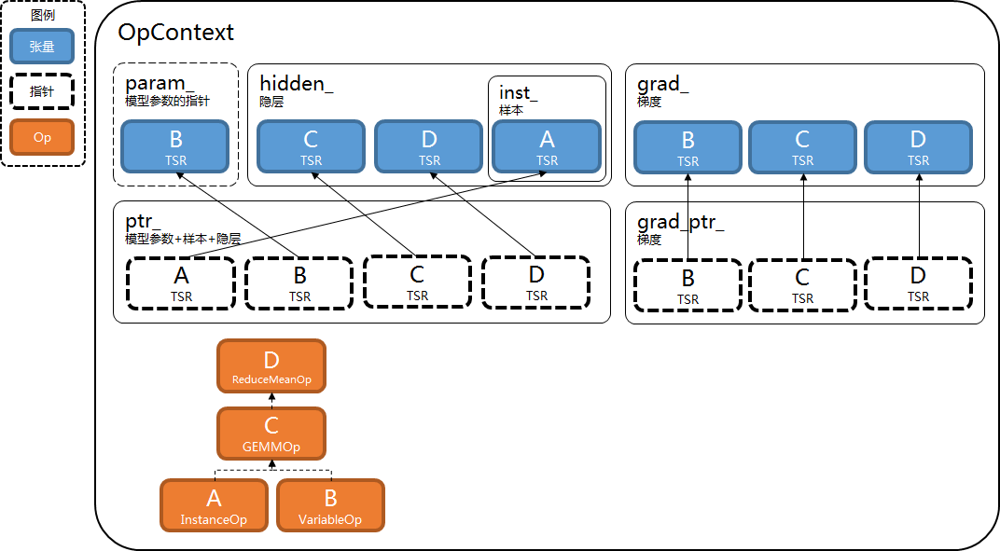

# 算子开发

[TOC]

开发算子需要以下步骤.

- 增加节点.
- 增加算子.
  - 增加单元测试.
- 增加文档.

## 增加节点

通过继承来增加新节点.

以下是所有节点基类.

- GraphNode, 节点.
  - GraphNodeUnaryBase, 1元节点.
    - GraphNodeUnaryElementWiseBase, 逐元素节点.
    - GraphNodeForAxisBase, 轴遍历节点.
    - GraphNodeReduceAxisBase, 轴规约节点.
  - GraphNodeBinaryBase, 2元节点.
    - GraphNodeBinaryElementWiseBase, 逐元素节点.
    - GraphNodeBinaryBroadcastBase, 广播节点.
    - GraphNodeConvBase, 卷积节点.
    - GraphNodePoolBase, 池化节点.

它们的头文件是["graph\_node.h"](../include/deepx_core/graph/graph_node.h)

选择合适的基类.

### 例子

参考注释.

#### AddNNode

```c++
// 头文件
// AddNNode输入多个节点, 不属于1元节点和2元节点, 只能继承GraphNode.
class AddNNode : public GraphNode {
 public:
  AddNNode(std::string name, std::vector<GraphNode*> X);
  // 用DEFINE_GRAPH_NODE_LIKE宏定义构造函数, 拷贝构造函数等函数.
  DEFINE_GRAPH_NODE_LIKE(AddNNode);
};

// 定义AddN函数, 它有助于写出更紧凑的Graph.
inline GraphNode* AddN(std::string name, std::vector<GraphNode*> X) {
  return new AddNNode(std::move(name), std::move(X));
}
```

```c++
// 实现文件
AddNNode::AddNNode(std::string name, std::vector<GraphNode*> X)
    : GraphNode(std::move(name)) {
  // 检查X的合法性.
  DXCHECK_THROW(!X.empty());
  for (const GraphNode* _X : X) {
    DXCHECK_THROW(_X->tensor_type() == TENSOR_TYPE_TSR);
  }

  // 初始化成员变量.
  input_ = std::move(X);
  node_type_ = GRAPH_NODE_TYPE_HIDDEN;
  tensor_type_ = TENSOR_TYPE_TSR;

  // 如果X的形状可用, 形状推理.
  if (HasShape(input_)) {
    std::vector<const Shape*> Xshape(input_size());
    for (int i = 0; i < input_size(); ++i) {
      Xshape[i] = &input_[i]->shape();
    }
    (void)AddNInferShape(Xshape, &shape_);
  }
}
```

#### GEMMNode

```c++
// 头文件
// GEMMNode是典型的2元节点, 但又不属于GraphNodeBinaryBase的子节点, 继承GraphNodeBinaryBase.
class GEMMNode : public GraphNodeBinaryBase {
 private:
  // 成员变量transX_和transY_, 对应参数transX和transY.
  int transX_ = 0;
  int transY_ = 0;
  // 用DEFINE_GRAPH_NODE_ATTR宏把属性"包起来".
  DEFINE_GRAPH_NODE_ATTR(GEMMNode, transX_, transY_);

 public:
  int transX() const noexcept { return transX_; }
  int transY() const noexcept { return transY_; }

 public:
  GEMMNode(std::string name, GraphNode* X, GraphNode* Y, int transX,
           int transY);
  DEFINE_GRAPH_NODE_LIKE(GEMMNode);
};

// 用DEFINE_GRAPH_NODE_CREATOR宏定义GEMM函数, 它有助于写出更紧凑的Graph.
DEFINE_GRAPH_NODE_CREATOR(GEMM)
```

```c++
// 实现文件
GEMMNode::GEMMNode(std::string name, GraphNode* X, GraphNode* Y, int transX,
                   int transY)
      // GraphNodeBinaryBase的构造函数.
      // 1. 检查参数合法性
      // 2. 初始化成员变量
    : GraphNodeBinaryBase(std::move(name), X, Y),
      transX_(transX),
      transY_(transY) {
  // 如果X和Y的形状可用, 形状推理.
  if (!X->shape().empty() && !Y->shape().empty()) {
    (void)GEMMInferShape(X->shape(), Y->shape(), transX_, transY_, &shape_);
  }
}
```

## 增加算子

通过继承来增加新算子.

以下是所有算子基类.

- Op, 算子.
  - OpImpl, 算子.
    - OpUnaryBase, 1元算子.
      - OpUnaryElementWiseBase, 逐元素算子.
      - OpForAxisBase, 轴遍历算子.
      - OpReduceAxisBase, 轴规约算子.
    - OpBinaryBase, 2元算子.
      - OpBinaryElementWiseBase, 逐元素算子.
      - OpBroadcastBase, 广播算子.
      - OpConvBase, 卷积算子.
      - OpPoolBase, 池化算子.

OpForAxisBase的实现文件是["for\_axis\_op.cc"](../src/graph/op/kernel/for_axis_op.cc).

OpReduceAxisBase的实现文件是["reduce\_axis\_op.cc"](../src/graph/op/kernel/reduce_axis_op.cc).

OpBroadcastBase的实现文件是["binary\_op.cc"](../src/graph/op/kernel/binary_op.cc).

OpConvBase的实现文件是["conv\_op.cc"](../src/graph/op/kernel/conv_op.cc).

OpPoolBase的实现文件是["pool\_op.cc"](../src/graph/op/kernel/pool_op.cc).

其它的头文件是["op.h"](../include/deepx_core/graph/op.h)和["op\_impl.h"](../include/deepx_core/graph/op_impl.h).

选择合适的基类.

### OpContext

介绍OpContext有助于理解算子开发.

OpContext有以下重要成员变量.

- param\_, 模型参数(字符串 -> 张量)的指针, 它的所有权不归OpContext所有.
- hidden\_, 隐层(字符串 -> 张量).
  - hidden\_.inst\_, 样本(字符串 -> 张量).
- ptr\_, 模型参数+隐层+样本(字符串 -> 张量的指针).
- grad\_, 梯度(字符串 -> 张量).
- grad\_ptr\_, 梯度(字符串 -> 张量的指针).

OpContext包含算子, 这些算子和Graph中的节点对应.



算子有OpContext所有重要成员变量的指针, 这些指针未在图中画出.

### 例子

参考注释.

#### AddNOp

```c++
// 实现文件
// AddNNode继承GraphNode, AddNOp继承对应的OpImpl.
class AddNOp : public OpImpl {
 private:
  // 算子可以有mutable成员变量/状态, 所以算子和OpContext都不多线程安全.
  // 为了多线程, Graph必须实例化多个OpContext对象.
  //
  // 通常在InitForward/InitBackward中初始化成员变量, 供后续Forward/Backward使用.
  // 通常在Forward中把结果保存在成员变量, 供后续Backward使用.
  std::vector<const Shape*> Xshape_;
  std::vector<const tsr_t*> X_;
  Shape Zshape_;
  tsr_t* Z_ = nullptr;
  tsr_t* gZ_ = nullptr;
  std::vector<tsr_t*> gX_;

 public:
  // 用DEFINE_OP_LIKE定义class_name虚函数.
  DEFINE_OP_LIKE(AddNOp);

  void InitForward() override {
    int input_size = node_->input_size();
    Xshape_.resize(input_size);
    X_.resize(input_size);
    for (int i = 0; i < input_size; ++i) {
      const GraphNode* Xnode = node_->input(i);
      // 从ptr_获取输入张量的地址.
      const tsr_t* X = GetPtrTSR(Xnode);
      Xshape_[i] = &X->shape();
      X_[i] = X;
    }
    // 形状推理, 失败则抛出异常.
    DXCHECK_THROW(AddNInferShape(Xshape_, &Zshape_));
    // 在hidden_创建输出张量, 在ptr_插入其地址.
    Z_ = InitHiddenTSR(node_, Zshape_);
  }

  void InitBackward() override {
    int input_size = node_->input_size();
    // 从grad_ptr_获取输入梯度的地址.
    // 如果gZ_是nullptr, 不需要回传梯度.
    gZ_ = GetGradPtrTSR(node_);
    gX_.resize(input_size);
    for (int i = 0; i < input_size; ++i) {
      const GraphNode* Xnode = node_->input(i);
      // 在grad_创建输出梯度, 在grad_ptr_插入其地址.
      // 如果gX_[i]是nullptr, 第i个输入不需要回传梯度.
      gX_[i] = InitGradTSR(Xnode, X_[i]->shape());
    }
  }

  // 前向计算.
  void Forward() override { AddN(X_, Z_); }

  // 后向计算.
  void Backward() override {
    if (gZ_) {
      // 注意: 梯度是累计式计算, 而不是覆盖式计算.
      AddNBackward(X_, *Z_, *gZ_, &gX_);
    }
  }
};

// 用GRAPH_NODE_OP_REGISTER宏注册节点类和算子类.
GRAPH_NODE_OP_REGISTER(AddN);
```

#### GEMMOp

```c++
// 实现文件
// GEMMNode继承GraphNodeBinaryBase, GEMMOp继承对应的OpBinaryBase.
class GEMMOp : public OpBinaryBase {
 private:
  GEMMAux aux_;
  GEMMJitAux<float_t> jaux_;

 public:
  DEFINE_OP_LIKE(GEMMOp);

  const Shape& InferShape() override {
    // 获取节点参数.
    int transX = ((const GEMMNode*)node_)->transX();
    int transY = ((const GEMMNode*)node_)->transY();
    // 形状推理, 失败则抛出异常.
    DXCHECK_THROW(GEMMPrepare(X_->shape(), Y_->shape(), transX, transY, &aux_));
    GEMMJitPrepare(aux_, &jaux_);
    return aux_.Z;
  }

  void InitBackward() override {
    OpBinaryBase::InitBackward();
    GEMMJitPrepareBackward(aux_, &jaux_);
  }

  // 前向计算.
  void Forward() override { GEMMJit(*X_, *Y_, Z_, aux_, jaux_); }

  // 后向计算.
  void Backward() override {
    if (gZ_) {
      // 注意: 梯度是累计式计算, 而不是覆盖式计算.
      GEMMJitBackward(*X_, *Y_, *Z_, *gZ_, gX_, gY_, aux_, jaux_);
    }
  }
};

// 用GRAPH_NODE_OP_REGISTER宏注册节点类和算子类.
GRAPH_NODE_OP_REGISTER(GEMM);
```

### 增加单元测试

#### 例子

##### AddNOp

参考["add\_n\_op\_test.cc"](../src/graph/op/kernel/add_n_op_test.cc).

##### GEMMOp

参考["gemm\_op\_test.cc"](../src/graph/op/kernel/gemm_op_test.cc).

## 增加文档

在[算子使用手册](op_manual.md)中增加文档.
