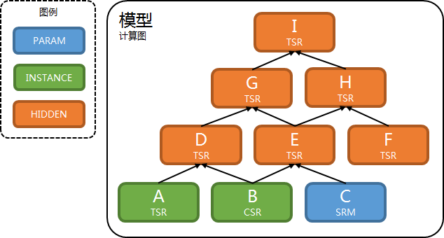

# 算子使用手册

[TOC]

本文档面向使用者, 将尽可能屏蔽实现细节.

除了标题使用"算子"外, 本文档使用"节点"表示节点和算子, 使用"计算图"表示计算图的表示层.

## 节点类型

节点类型有以下几种.

| 节点类型 | 简称 | 描述 |
| - | - | - |
| GRAPH\_NODE\_TYPE\_PARAM | PARAM | 变量节点, VaribaleNode |
| GRAPH\_NODE\_TYPE\_INSTANCE | INSTANCE | 样本节点, InstanceNode |
| GRAPH\_NODE\_TYPE\_HIDDEN | HIDDEN | 隐层节点, 其它所有节点 |

## 节点名称

所有构造函数的第1个参数设置节点名称. 例如.

```c++
ReluNode(std::string name, GraphNode* X);
GraphNode* Relu(std::string name, GraphNode* X);
```

合法的节点名称不能为空, 且只包含数字字母(0-9a-zA-Z), 下划线(\_), 斜杠(/), 冒号(:).

变量节点和样本节点的名称必须合法.

如果隐层节点的名称非法, 将为该节点赋予随机且在计算图内唯一的名称.

计算图中不能出现同名节点.

## 节点张量类型

节点张量类型有以下几种.

| 节点张量类型 | 简称 | 描述 | 支持的节点类型 |
| - | - | - | - |
| TENSOR\_TYPE\_TSR | TSR | 浮点型稠密张量 | PARAM, INSTANCE, HIDDEN |
| TENSOR\_TYPE\_SRM | SRM | 稀疏行矩阵 | PARAM |
| TENSOR\_TYPE\_CSR | CSR | 压缩稀疏行矩阵 | INSTANCE |
| TENSOR\_TYPE\_TSRI | TSRI | 整型稠密张量 | INSTANCE |
| TENSOR\_TYPE\_TSRS | TSRS | 字符串型稠密张量 | INSTANCE |

参考[张量](tensor.md).

## 计算图例子



节点名称分别是A, B, C, D, ..., I.

节点类型由不同颜色区分.

节点张量类型在节点名称下方.

节点类名未在图中画出.

## 节点初始化

变量或常量节点的部分构造函数接收以下参数, 它们设置节点的初始化方式.

```c++
int initializer_type, double initializer_param1, double initializer_param2
```

| initializer\_type | 初始化方式 | 支持的节点张量类型 |
| - | - | - |
| TENSOR\_INITIALIZER\_TYPE\_ZEROS | 全0初始化 | TSR, SRM |
| TENSOR\_INITIALIZER\_TYPE\_ONES | 全1初始化 | TSR, SRM |
| TENSOR\_INITIALIZER\_TYPE\_CONSTANT | 常数(initializer\_param1)初始化 | TSR, SRM |
| TENSOR\_INITIALIZER\_TYPE\_RAND | 均匀分布(下限是initializer\_param1, 上限是initializer\_param2)初始化 | TSR, SRM |
| TENSOR\_INITIALIZER\_TYPE\_RANDN | 正态分布(均值是initializer\_param1, 标准差是initializer\_param2)初始化 | TSR, SRM |
| TENSOR\_INITIALIZER\_TYPE\_RAND\_LECUN | Lecun均匀分布初始化 | TSR |
| TENSOR\_INITIALIZER\_TYPE\_RANDN\_LECUN | Lecun正态分布初始化 | TSR |
| TENSOR\_INITIALIZER\_TYPE\_RAND\_XAVIER | Xavier均匀分布初始化 | TSR |
| TENSOR\_INITIALIZER\_TYPE\_RANDN\_XAVIER | Xavier正态分布初始化 | TSR |
| TENSOR\_INITIALIZER\_TYPE\_RAND\_HE | He均匀分布初始化 | TSR |
| TENSOR\_INITIALIZER\_TYPE\_RANDN\_HE | He正态分布初始化 | TSR |
| TENSOR\_INITIALIZER\_TYPE\_RAND\_INT | 整数均匀分布(下限是initializer\_param1取整, 上限是initializer\_param2取整)初始化 | TSR |

## 节点API约定

节点API的头文件是["graph\_node.h"](../include/deepx_core/graph/graph_node.h).

大部分节点的构造方式有2种.

例如.

```c++
// 使用者既可以在栈上, 也可以在堆上构造节点.
ReluNode(std::string name, GraphNode* X);
// 在堆上构造节点, 并返回给使用者, 所有权属于使用者.
GraphNode* Relu(std::string name, GraphNode* X);
```

下面文档有以下约定.

- 将节点的返回张量记为Z.
- 轴从0开始计数.
- 以"Batch"开头的节点表示输入节点和输出节点的第0个轴是batch轴.
- axis做为参数表示轴.
  - 如果axis大于等于0, 表示第axis个轴.
  - 如果axis小于0, 表示倒数第-axis个轴.
- 省略节点名称参数.

## 节点API

### SigmoidNode

```c++
SigmoidNode(std::string name, GraphNode* X);
GraphNode* Sigmoid(std::string name, GraphNode* X);
```

逐元素计算X的sigmoid.

参数.

- X, TSR.

返回.

- Z, 形状和X相同的TSR.

### TanhNode

```c++
TanhNode(std::string name, GraphNode* X);
GraphNode* Tanh(std::string name, GraphNode* X);
```

逐元素计算X的tanh.

参数和返回.

- 参考SigmoidNode.

### ReluNode

```c++
ReluNode(std::string name, GraphNode* X);
GraphNode* Relu(std::string name, GraphNode* X);
```

逐元素计算X的rectified linear unit(relu).

$$
Z_i = \left\{
\begin{aligned}
& X_i & & \text{if } X_i > 0 \\
& 0 & & \text{otherwise}
\end{aligned}
\right.
$$

参数和返回.

- 参考SigmoidNode.

### LeakyReluNode

```c++
LeakyReluNode(std::string name, GraphNode* X, double alpha);
GraphNode* LeakyRelu(std::string name, GraphNode* X, double alpha);
```

逐元素计算X的leaky relu.

$$
Z_i = \left\{
\begin{aligned}
& X_i & & \text{if } X_i > 0 \\
& \alpha X_i & & \text{otherwise}
\end{aligned}
\right.
$$

参数.

- X, TSR.
- alpha, $\alpha$.

返回.

- Z, 形状和X相同的TSR.

### EluNode

```c++
EluNode(std::string name, GraphNode* X, double alpha);
GraphNode* Elu(std::string name, GraphNode* X, double alpha);
```

逐元素计算X的exponential linear unit(elu).

$$
Z_i = \left\{
\begin{aligned}
& X_i & & \text{if } X_i > 0 \\
& \alpha (\exp(X_i) - 1) & & \text{otherwise}
\end{aligned}
\right.
$$

参数.

- X, TSR.
- alpha, $\alpha$.

返回.

- Z, 形状和X相同的TSR.

### SeluNode

```c++
SeluNode(std::string name, GraphNode* X, double lambda, double alpha);
GraphNode* Selu(std::string name, GraphNode* X, double lambda, double alpha);
```

逐元素计算X的scaled exponential linear unit(selu).

$$
Z_i = \left\{
\begin{aligned}
& \lambda X_i & & \text{if } X_i > 0 \\
& \lambda \alpha (\exp(X_i) - 1) & & \text{otherwise}
\end{aligned}
\right.
$$

参数.

- X, TSR.
- lambda, $\lambda$.
- alpha, $\alpha$.

返回.

- Z, 形状和X相同的TSR.

### GeluNode

```c++
GeluNode(std::string name, GraphNode* X);
GraphNode* Gelu(std::string name, GraphNode* X);
```

逐元素计算X的gaussian error linear unit(gelu).

$$
Z_i = 0.5 \cdot X_i(1 + \tanh(\sqrt{2/\pi} (X_i + 0.044715 \cdot {X_i}^3)))
$$

参数和返回.

- 参考SigmoidNode.

### SoftPlusNode

```c++
SoftPlusNode(std::string name, GraphNode* X);
GraphNode* SoftPlus(std::string name, GraphNode* X);
```

逐元素计算X的softplus.

$$
Z_i = \log(1 + \exp(X_i))
$$

参数和返回.

- 参考SigmoidNode.

### SwishNode

```c++
SwishNode(std::string name, GraphNode* X);
GraphNode* Swish(std::string name, GraphNode* X);
```

逐元素计算X的self-gated activation function(swish).

$$
Z_i = X_i \cdot \text{sigmoid}(X_i)
$$

参数和返回.

- 参考SigmoidNode.

### ExpNode

```c++
ExpNode(std::string name, GraphNode* X);
GraphNode* Exp(std::string name, GraphNode* X);
```

逐元素计算X的exp.

参数和返回.

- 参考SigmoidNode.

### LogNode

```c++
LogNode(std::string name, GraphNode* X);
GraphNode* Log(std::string name, GraphNode* X);
```

逐元素计算X的log.

参数和返回.

- 参考SigmoidNode.

### NegateNode

```c++
NegateNode(std::string name, GraphNode* X);
GraphNode* Negate(std::string name, GraphNode* X);
```

逐元素计算X的相反数.

参数和返回.

- 参考SigmoidNode.

### InvNode/ReciprocalNode

```c++
InvNode(std::string name, GraphNode* X);
ReciprocalNode(std::string name, GraphNode* X);
GraphNode* Inv(std::string name, GraphNode* X);
GraphNode* Reciprocal(std::string name, GraphNode* X);
```

逐元素计算X的倒数.

参数和返回.

- 参考SigmoidNode.

### SqrtNode

```c++
SqrtNode(std::string name, GraphNode* X);
GraphNode* Sqrt(std::string name, GraphNode* X);
```

逐元素计算X的平方根.

参数和返回.

- 参考SigmoidNode.

### CbrtNode

```c++
CbrtNode(std::string name, GraphNode* X);
GraphNode* Cbrt(std::string name, GraphNode* X);
```

逐元素计算X的立方根.

参数和返回.

- 参考SigmoidNode.

### SquareNode

```c++
SquareNode(std::string name, GraphNode* X);
GraphNode* Square(std::string name, GraphNode* X);
```

逐元素计算X的平方.

参数和返回.

- 参考SigmoidNode.

### CubicNode

```c++
CubicNode(std::string name, GraphNode* X);
GraphNode* Cubic(std::string name, GraphNode* X);
```

逐元素计算X的立方.

参数和返回.

- 参考SigmoidNode.

### DropoutNode

```c++
DropoutNode(std::string name, GraphNode* X, double keep_prob);
GraphNode* Dropout(std::string name, GraphNode* X, double keep_prob);
```

逐元素计算X的dropout.

$$
Z_i = \left\{
\begin{aligned}
& 0 & & \text{with probability 1 - keep\_prob} \\
& \frac{X_i}{\text{keep\_prob}} & & \text{otherwise}
\end{aligned}
\right.
$$

参数.

- X, TSR.
- keep\_prob, 元素被保留的概率.

返回.

- Z, 形状和X相同的TSR, 有随机性.

### SignNode

```c++
SignNode(std::string name, GraphNode* X);
GraphNode* Sign(std::string name, GraphNode* X);
```

逐元素计算X的符号.

$$
Z_i = \left\{
\begin{aligned}
& 1 & & \text{if } X_i > 0 \\
& 0 & & \text{if } X_i = 0 \\
& -1 & & \text{otherwise}
\end{aligned}
\right.
$$

参数.

- X, TSR.

返回.

- Z, 形状和X相同的TSR.

### AbsNode

```c++
AbsNode(std::string name, GraphNode* X);
GraphNode* Abs(std::string name, GraphNode* X);
```

逐元素计算X的绝对值.

参数和返回.

- 参考SigmoidNode.

### ClipByValueNode

```c++
ClipByValueNode(std::string name, GraphNode* X, double clip_value_min,
                double clip_value_max);
GraphNode* ClipByValue(std::string name, GraphNode* X, double clip_value_min,
                       double clip_value_max);
```

逐元素将张量裁剪到[clip\_value\_min, clip\_value\_max]范围.

$$
Z_i = \left\{
\begin{aligned}
& \text{clip\_value\_min} & & \text{if } X_i \lt \text{clip\_value\_min} \\
& \text{clip\_value\_max} & & \text{if } X_i \gt \text{clip\_value\_max} \\
& X_i & & \text{otherwise}
\end{aligned}
\right.
$$

参数.

- X, TSR.
- clip\_value\_min, 裁剪后的最小值.
- clip\_value\_max, 裁剪后的最大值.

返回.

- Z, 形状和X相同的TSR.

### MatrixBandPartNode

```c++
MatrixBandPartNode(std::string name, GraphNode* X, int num_lower,
                   int num_upper);
GraphNode* MatrixBandPart(std::string name, GraphNode* X, int num_lower,
                          int num_upper);
```

复制张量, 将每个最内层矩阵中心区域外的所有元素设置为0.

参数.

- X, TSR.
- num\_lower, 要保留的次对角元数量. 如果为负, 则保留整个下三角.
- num\_upper, 要保留的超对角元数量. 如果为负, 则保留整个上三角.

返回.

- Z, 形状和X相同的TSR.

例子(类python伪码).

```
X = TSR([[1,  2,  3,  4],
         [5,  6,  7,  8],
         [9, 10, 11, 12]])
MatrixBandPart(X, 0, 0) = TSR([[1, 0,  0, 0],
                               [0, 6,  0, 0],
                               [0, 0, 11, 0]])
MatrixBandPart(X, 0, -1) = TSR([[1, 2,  3,  4],
                                [0, 6,  7,  8],
                                [0, 0, 11, 12]])
MatrixBandPart(X, -1, 1) = TSR([[1,  2,  0,  0],
                                [5,  6,  7,  0],
                                [9, 10, 11, 12]])
```

### IdentityNode

```c++
Identity(std::string name, GraphNode* X);
GraphNode* Identity(std::string name, GraphNode* X);
```

逐元素计算X到Z的拷贝.

参数.

- X, TSR.

返回.

- Z, 形状和X相同的TSR.

### AddNode

```c++
AddNode(std::string name, GraphNode* X, GraphNode* Y);
GraphNode* Add(std::string name, GraphNode* X, GraphNode* Y);
```

逐元素计算X加Y.

参数.

- X, TSR.
- Y, 形状和X相同的TSR.

返回.

- Z, 形状和X相同的TSR.

### SubNode

```c++
SubNode(std::string name, GraphNode* X, GraphNode* Y);
GraphNode* Sub(std::string name, GraphNode* X, GraphNode* Y);
```

逐元素计算X减Y.

参数和返回.

- 参考AddNode.

### MulNode

```c++
MulNode(std::string name, GraphNode* X, GraphNode* Y);
GraphNode* Mul(std::string name, GraphNode* X, GraphNode* Y);
```

逐元素计算X乘Y.

参数和返回.

- 参考AddNode.

### DivNode

```c++
DivNode(std::string name, GraphNode* X, GraphNode* Y);
GraphNode* Div(std::string name, GraphNode* X, GraphNode* Y);
```

逐元素计算X除Y.

参数和返回.

- 参考AddNode.

### PowNode

```c++
PowNode(std::string name, GraphNode* X, GraphNode* Y);
GraphNode* Pow(std::string name, GraphNode* X, GraphNode* Y);
```

逐元素计算X的Y次方.

参数和返回.

- 参考AddNode.

### MaxNode

```c++
MaxNode(std::string name, GraphNode* X, GraphNode* Y);
GraphNode* Max(std::string name, GraphNode* X, GraphNode* Y);
```

逐元素计算X和Y的较大值.

参数和返回.

- 参考AddNode.

### MinNode

```c++
MinNode(std::string name, GraphNode* X, GraphNode* Y);
GraphNode* Min(std::string name, GraphNode* X, GraphNode* Y);
```

逐元素计算X和Y的较小值.

参数和返回.

- 参考AddNode.

### EqualNode

```c++
EqualNode(std::string name, GraphNode* X, GraphNode* Y);
GraphNode* Equal(std::string name, GraphNode* X, GraphNode* Y);
```

逐元素计算X是否等于Y.

$$
Z_i = \left\{
\begin{aligned}
& 1 & & \text{if } X_i = Y_i \\
& 0 & & \text{otherwise}
\end{aligned}
\right.
$$

参数和返回.

- 参考AddNode.

### GreaterNode

```c++
GreaterNode(std::string name, GraphNode* X, GraphNode* Y);
GraphNode* Greater(std::string name, GraphNode* X, GraphNode* Y);
```

逐元素计算X是否大于Y.

$$
Z_i = \left\{
\begin{aligned}
& 1 & & \text{if } X_i > Y_i \\
& 0 & & \text{otherwise}
\end{aligned}
\right.
$$

参数和返回.

- 参考AddNode.

### GreaterEqualNode

```c++
GreaterEqualNode(std::string name, GraphNode* X, GraphNode* Y);
GraphNode* GreaterEqual(std::string name, GraphNode* X, GraphNode* Y);
```

逐元素计算X是否大于等于Y.

$$
Z_i = \left\{
\begin{aligned}
& 1 & & \text{if } X_i \ge Y_i \\
& 0 & & \text{otherwise}
\end{aligned}
\right.
$$

参数和返回.

- 参考AddNode.

### LessNode

```c++
LessNode(std::string name, GraphNode* X, GraphNode* Y);
GraphNode* Less(std::string name, GraphNode* X, GraphNode* Y);
```

逐元素计算X是否小于Y.

$$
Z_i = \left\{
\begin{aligned}
& 1 & & \text{if } X_i < Y_i \\
& 0 & & \text{otherwise}
\end{aligned}
\right.
$$

参数和返回.

- 参考AddNode.

### LessEqualNode

```c++
LessEqualNode(std::string name, GraphNode* X, GraphNode* Y);
GraphNode* LessEqual(std::string name, GraphNode* X, GraphNode* Y);
```

逐元素计算X是否小于等于Y.

$$
Z_i = \left\{
\begin{aligned}
& 1 & & \text{if } X_i \le Y_i \\
& 0 & & \text{otherwise}
\end{aligned}
\right.
$$

参数和返回.

- 参考AddNode.

### BroadcastAddNode

```c++
BroadcastAddNode(std::string name, GraphNode* X, GraphNode* Y);
GraphNode* BroadcastAdd(std::string name, GraphNode* X, GraphNode* Y);
```

广播计算X加Y.

参考广播规则<sup>1,2</sup>.

参数.

- X, TSR.
- Y, TSR.

返回.

- Z, TSR.

例子(类python伪码).

```
# (2, 3)
X = TSR([[0, 1, 2], [3, 4, 5]])
# (1)
Y = TSR([1])
# (2, 3)
BroadcastAdd(X, Y) = TSR([[1, 2, 3], [4, 5, 6]])
```

```
# (2, 3)
X = TSR([[0, 1, 2], [3, 4, 5]])
# (3)
Y = TSR([0, 1, 2])
# (2, 3)
BroadcastAdd(X, Y) = TSR([[0, 2, 4], [3, 5, 7]])
```

```
# (2, 1, 4)
X = TSR([[[0, 1, 2, 3]],
         [[4, 5, 6, 7]]])
# (1, 3, 1)
Y = TSR([[[0],
          [1],
          [2]]])
# (2, 3, 4)
BroadcastAdd(X, Y) = TSR(
  [[[0, 1, 2, 3],
    [1, 2, 3, 4],
    [2, 3, 4, 5]],
   [[4, 5, 6, 7],
    [5, 6, 7, 8],
    [6, 7, 8, 9]]]
)
```

### BroadcastSubNode

```c++
BroadcastSubNode(std::string name, GraphNode* X, GraphNode* Y);
GraphNode* BroadcastSub(std::string name, GraphNode* X, GraphNode* Y);
```

广播计算X减Y.

参考广播规则<sup>1,2</sup>.

参数和返回.

- 参考BroadcastAddNode.

### BroadcastMulNode

```c++
BroadcastMulNode(std::string name, GraphNode* X, GraphNode* Y);
GraphNode* BroadcastMul(std::string name, GraphNode* X, GraphNode* Y);
```

广播计算X乘Y.

参考广播规则<sup>1,2</sup>.

参数和返回.

- 参考BroadcastAddNode.

### BroadcastDivNode

```c++
BroadcastDivNode(std::string name, GraphNode* X, GraphNode* Y);
GraphNode* BroadcastDiv(std::string name, GraphNode* X, GraphNode* Y);
```

广播计算X除Y.

参考广播规则<sup>1,2</sup>.

参数和返回.

- 参考BroadcastAddNode.

### BroadcastPowNode

```c++
BroadcastPowNode(std::string name, GraphNode* X, GraphNode* Y);
GraphNode* BroadcastPow(std::string name, GraphNode* X, GraphNode* Y);
```

广播计算X的Y次方.

参考广播规则<sup>1,2</sup>.

参数和返回.

- 参考BroadcastAddNode.

### BroadcastMaxNode

```c++
BroadcastMaxNode(std::string name, GraphNode* X, GraphNode* Y);
GraphNode* BroadcastMax(std::string name, GraphNode* X, GraphNode* Y);
```

广播计算X和Y的较大值.

参考广播规则<sup>1,2</sup>.

参数和返回.

- 参考BroadcastAddNode.

### BroadcastMinNode

```c++
BroadcastMinNode(std::string name, GraphNode* X, GraphNode* Y);
GraphNode* BroadcastMin(std::string name, GraphNode* X, GraphNode* Y);
```

广播计算X和Y的较小值.

参考广播规则<sup>1,2</sup>.

参数和返回.

- 参考BroadcastAddNode.

### BroadcastEqualNode

```c++
BroadcastEqualNode(std::string name, GraphNode* X, GraphNode* Y);
GraphNode* BroadcastEqual(std::string name, GraphNode* X, GraphNode* Y);
```

广播计算X是否等于Y.

参考广播规则<sup>1,2</sup>.

参数和返回.

- 参考EqualNode和BroadcastAddNode.

### BroadcastGreaterNode

```c++
BroadcastGreaterNode(std::string name, GraphNode* X, GraphNode* Y);
GraphNode* BroadcastGreater(std::string name, GraphNode* X, GraphNode* Y);
```

广播计算X是否大于Y.

参考广播规则<sup>1,2</sup>.

参数和返回.

- 参考GreaterNode和BroadcastAddNode.

### BroadcastGreaterEqualNode

```c++
BroadcastGreaterEqualNode(std::string name, GraphNode* X, GraphNode* Y);
GraphNode* BroadcastGreaterEqual(std::string name, GraphNode* X, GraphNode* Y);
```

广播计算X是否大于等于Y.

参考广播规则<sup>1,2</sup>.

参数和返回.

- 参考GreaterEqualNode和BroadcastAddNode.

### BroadcastLessNode

```c++
BroadcastLessNode(std::string name, GraphNode* X, GraphNode* Y);
GraphNode* BroadcastLess(std::string name, GraphNode* X, GraphNode* Y);
```

广播计算X是否小于Y.

参考广播规则<sup>1,2</sup>.

参数和返回.

- 参考LessNode和BroadcastAddNode.

### BroadcastLessEqualNode

```c++
BroadcastLessEqualNode(std::string name, GraphNode* X, GraphNode* Y);
GraphNode* BroadcastLessEqual(std::string name, GraphNode* X, GraphNode* Y);
```

广播计算X是否小于等于Y.

参考广播规则<sup>1,2</sup>.

参数和返回.

- 参考LessEqualNode和BroadcastAddNode.

### BroadcastToNode

```c++
BroadcastToNode(std::string name, GraphNode* X, const Shape& shape);
GraphNode* BroadcastTo(std::string name, GraphNode* X, const Shape& shape);
```

将X单向广播到新形状.

参考单向广播规则<sup>3</sup>.

参数.

- X, TSR.
- shape, 新形状.

返回.

- Z, 形状是shape的TSR.

### BroadcastToLikeNode

```c++
BroadcastToLikeNode(std::string name, GraphNode* X, GraphNode* Y);
GraphNode* BroadcastToLike(std::string name, GraphNode* X, GraphNode* Y);
```

将X单向广播到Y.

参考单向广播规则<sup>3</sup>.

参数.

- X, TSR.
- Y, TSR.

返回.

- Z, 形状和Y相同的TSR.

### SoftmaxNode

```c++
SoftmaxNode(std::string name, GraphNode* X, int axis = -1);
GraphNode* Softmax(std::string name, GraphNode* X, int axis = -1);
```

在X的axis轴上进行softmax变换.

参数.

- X, TSR.
- axis, 轴.

返回.

- Z, 形状和X相同的TSR.

### Softmax2Node

```c++
Softmax2Node(std::string name, GraphNode* X, int axis = -1);
GraphNode* Softmax2(std::string name, GraphNode* X, int axis = -1);
```

在X的axis轴上进行softmax变换, 再乘X的axis轴的维度, 即softmax的类目数.

参数和返回.

- 参考SoftmaxNode.

### LogSoftmaxNode

```c++
LogSoftmaxNode(std::string name, GraphNode* X, int axis = -1);
GraphNode* LogSoftmax(std::string name, GraphNode* X, int axis = -1);
```

在X的axis轴上进行softmax变换, 再计算log.

参数和返回.

- 参考SoftmaxNode.

### Normalize2Node

```c++
Normalize2Node(std::string name, GraphNode* X, int axis = -1);
GraphNode* Normalize2(std::string name, GraphNode* X, int axis = -1);
```

在X的axis轴上进行L2 norm标准化变换.

令$X_i$表示X的axis轴, $Z_i$表示Z的axis轴, 则有.

$$
Z_{ij} = \frac{X_{ij}}{\sqrt{\sum_j X_{ij}^2}}
$$

参数和返回.

- 参考SoftmaxNode.

### ReduceMeanNode

```c++
ReduceMeanNode(std::string name, GraphNode* X, int axis, int keep_dim);
GraphNode* ReduceMean(std::string name, GraphNode* X, int axis, int keep_dim);
```

在X的axis轴上进行均值规约.

参数.

- X, TSR.
- axis, 轴.
- keep\_dim, 是否保留axis轴.
  - 1, Z的axis轴的维度是1, 其它轴的维度和X相同, Z的阶数和X的阶数相同.
  - 0, Z的axis轴被剪除, 其它轴的维度和X相同, Z的阶数比X的阶数小1.

返回.

- Z, TSR.

```c++
ReduceMeanNode(std::string name, GraphNode* X);
GraphNode* ReduceMean(std::string name, GraphNode* X);
```

对X的所有元素进行均值规约.

参数.

- X, TSR.

返回.

- Z, 形状是(1)的TSR.


### ReduceSumNode

```c++
ReduceSumNode(std::string name, GraphNode* X, int axis, int keep_dim);
GraphNode* ReduceSum(std::string name, GraphNode* X, int axis, int keep_dim);
```

在X的axis轴上进行和规约.

参数和返回.

- 参考ReduceMeanNode.

```c++
ReduceSumNode(std::string name, GraphNode* X);
GraphNode* ReduceSum(std::string name, GraphNode* X);
```

对X的所有元素进行和规约.

参数和返回.

- 参考ReduceMeanNode.

### ReduceMaxNode

```c++
ReduceMaxNode(std::string name, GraphNode* X, int axis, int keep_dim);
GraphNode* ReduceMax(std::string name, GraphNode* X, int axis, int keep_dim);
```

在X的axis轴上进行最大值规约.

参数和返回.

- 参考ReduceMeanNode.

```c++
ReduceMaxNode(std::string name, GraphNode* X);
GraphNode* ReduceMax(std::string name, GraphNode* X);
```

对X的所有元素进行最大值规约.

参数和返回.

- 参考ReduceMeanNode.

### ReduceMinNode

```c++
ReduceMinNode(std::string name, GraphNode* X, int axis, int keep_dim);
GraphNode* ReduceMin(std::string name, GraphNode* X, int axis, int keep_dim);
```

在X的axis轴上进行最小值规约.

参数和返回.

- 参考ReduceMeanNode.

```c++
ReduceMinNode(std::string name, GraphNode* X);
GraphNode* ReduceMin(std::string name, GraphNode* X);
```

对X的所有元素进行最小值规约.

参数和返回.

- 参考ReduceMeanNode.

### ReduceL1Node

```c++
ReduceL1Node(std::string name, GraphNode* X, int axis, int keep_dim);
GraphNode* ReduceL1(std::string name, GraphNode* X, int axis, int keep_dim);
```

在X的axis轴上进行L1 norm规约.

令$X_i$表示X的axis轴, $Z_i$表示Z的axis轴, 则有.

$$
Z_i = \sum_j|X_{ij}|
$$

参数和返回.

- 参考ReduceMeanNode.

```c++
ReduceL1Node(std::string name, GraphNode* X);
GraphNode* ReduceL1(std::string name, GraphNode* X);
```

对X的所有元素进行L1 norm规约.

$$
Z = \sum_j|X_j|
$$

参数和返回.

- 参考ReduceMeanNode.

### ReduceL2Node

```c++
ReduceL2Node(std::string name, GraphNode* X, int axis, int keep_dim);
GraphNode* ReduceL2(std::string name, GraphNode* X, int axis, int keep_dim);
```

在X的axis轴上进行L2 norm规约.

令$X_i$表示X的axis轴, $Z_i$表示Z的axis轴, 则有.

$$
Z_i = \sqrt{\sum_j X_{ij}^2}
$$

参数和返回.

- 参考ReduceMeanNode.

```c++
ReduceL2Node(std::string name, GraphNode* X);
GraphNode* ReduceL2(std::string name, GraphNode* X);
```

对X的所有元素进行L2 norm规约.

$$
Z = \sqrt{\sum_j X_j^2}
$$

参数和返回.

- 参考ReduceMeanNode.

### ArgMaxNode

```c++
ArgMaxNode(std::string name, GraphNode* X, int axis = 0);
GraphNode* ArgMax(std::string name, GraphNode* X, int axis = 0);
```

在X的axis轴上计算最大值的下标.

参数.

- X, TSR.
- axis, 轴.

返回.

- Z, TSR.

例子(类python伪码).

```
# (2, 3, 4)
X = TSR([[[ 7,  0, 23,  6],
          [ 5,  1, 13, 10],
          [21, 20, 14, 18]],
         [[22,  9, 16,  2],
          [11,  3, 15, 19],
          [17, 12,  4,  8]]])
# (3, 4)
ArgMax(X, 0) = TSR([[1, 1, 0, 0],
                    [1, 1, 1, 1],
                    [0, 0, 0, 0]])
# (2, 4)
ArgMax(X, 1) = TSR([[2, 2, 0, 2],
                    [0, 2, 0, 1]])
# (2, 3)
ArgMax(X, 2) = TSR([[2, 2, 0],
                    [0, 3, 0]])
```

### ArgMinNode

```c++
ArgMinNode(std::string name, GraphNode* X, int axis = 0);
GraphNode* ArgMin(std::string name, GraphNode* X, int axis = 0);
```

在X的axis轴上计算最小值的下标.

参数.

- X, TSR.
- axis, 轴.

返回.

- Z, TSR.

例子(类python伪码).

```
# (2, 3, 4)
X = TSR([[[ 7,  0, 23,  6],
          [ 5,  1, 13, 10],
          [21, 20, 14, 18]],
         [[22,  9, 16,  2],
          [11,  3, 15, 19],
          [17, 12,  4,  8]]])
# (3, 4)
ArgMin(X, 0) = TSR([[0, 0, 1, 1],
                    [0, 0, 0, 0],
                    [1, 1, 1, 1]])
# (2, 4)
ArgMin(X, 1) = TSR([[1, 0, 1, 0],
                    [1, 1, 2, 0]])
# (2, 3)
ArgMin(X, 2) = TSR([[1, 1, 2],
                    [3, 1, 2]])
```

### BatchFMInteractionNode

```c++
BatchFMInteractionNode(std::string name, GraphNode* X);
GraphNode* BatchFMInteraction(std::string name, GraphNode* X);
```

以batch方式对X中m个长度是n的向量两两相乘, 得到m*(m - 1)/2个长度是n的向量.

参数.

- X, 形如(batch, m, n)的TSR.

返回.

- Z, 形如(batch, m*(m - 1)/2, n)的TSR.

例子(类python伪码).

```
# (2, 4, 3)
X = TSR([[[ 0,  1,  2],
          [ 3,  4,  5],
          [ 6,  7,  8],
          [ 9, 10, 11]],
         [[12, 13, 14],
          [15, 16, 17],
          [18, 19, 20],
          [21, 22, 23]]])
# (2, 6, 3)
BatchFMInteraction(X) = TSR(
  [[[  0,   4,  10],
    [  0,   7,  16],
    [  0,  10,  22],
    [ 18,  28,  40],
    [ 27,  40,  55],
    [ 54,  70,  88]],
   [[180, 208, 238],
    [216, 247, 280],
    [252, 286, 322],
    [270, 304, 340],
    [315, 352, 391],
    [378, 418, 460]]]
)
```

### BatchFMInteraction2Node

```c++
BatchFMInteraction2Node(std::string name, GraphNode* X, GraphNode* Y);
GraphNode* BatchFMInteraction2(std::string name, GraphNode* X, GraphNode* Y);
```

以batch方式对X中m1个长度是n的向量和Y中m2个长度是n的向量两两相乘, 得到m1*m2个长度是n的向量.

参数.

- X, 形如(batch, m1, n)的TSR.
- Y, 形如(batch, m2, n)的TSR.

返回.

- Z, 形如(batch, m1*m2, n)的TSR.

例子(类python伪码).

```
# (2, 2, 3)
X = TSR([[[ 0,  1,  2],
          [ 3,  4,  5]],
         [[ 6,  7,  8],
          [ 9, 10, 11]]])
# (2, 3, 3)
Y = TSR([[[ 0,  1,  2],
          [ 3,  4,  5],
          [ 6,  7,  8]],
         [[ 9, 10, 11],
          [12, 13, 14],
          [15, 16, 17]]])
# (2, 6, 3)
BatchFMInteraction2(X, Y) = TSR(
  [[[  0,   1,   4],
    [  0,   4,  10],
    [  0,   7,  16],
    [  0,   4,  10],
    [  9,  16,  25],
    [ 18,  28,  40]],
   [[ 54,  70,  88],
    [ 72,  91, 112],
    [ 90, 112, 136],
    [ 81, 100, 121],
    [108, 130, 154],
    [135, 160, 187]]]
)
```

### BatchFMQuadraticNode

```c++
BatchFMQuadraticNode(std::string name, GraphNode* X, GraphNode* V);
GraphNode* BatchFMQuadratic(std::string name, GraphNode* X, GraphNode* V);
```

以batch方式计算FM 2阶组合.

$$
Z_i = \sum_{l=0}^n \left( \sum_{j=0} \sum_{k=j+1} V_{ij} V_{ik} X_{ij} X_{ik} \right)_l
$$

参数.

- X, 形如(batch, ?)的CSR.
  - 令$X_{ij}$表示X的第i行中, 第j个id的value.
- V, 形如(m, n)的TSR.
  - 令$V_{ij}$表示X的第i行中, 第j个id的嵌入, 它是V的第"id % m"行.

返回.

- Z, 形如(batch, 1)的TSR.

### BatchGroupFMQuadraticNode

```c++
BatchGroupFMQuadraticNode(std::string name, GraphNode* X);
GraphNode* BatchGroupFMQuadratic(std::string name, GraphNode* X);
```

以batch方式计算FM 2阶组合.

$$
Z_i = \sum_{l=0}^n \left(\sum_{j=0}^m \sum_{k=j+1}^m X_{ij} X_{ik}\right)_l
$$

参数.

- X, 形如(batch, m, n)的TSR.

返回.

- Z, 形如(batch, 1)的TSR.

### BatchGroupFMQuadratic2Node

```c++
BatchGroupFMQuadratic2Node(std::string name, GraphNode* X);
GraphNode* BatchGroupFMQuadratic2(std::string name, GraphNode* X);
```

以batch方式计算FM 2阶组合.

$$
Z_i = \sum_{j=0}^m \sum_{k=j+1}^m X_{ij} X_{ik}
$$

参数.

- X, 形如(batch, m, n)的TSR.

返回.

- Z, 形如(batch, n)的TSR.

### Conv1dNode

```c++
Conv1dNode(std::string name, GraphNode* X, GraphNode* K, int data_format,
           int stride, int dilation, int padding);
Conv1dNode(std::string name, GraphNode* X, GraphNode* K, int data_format,
           int stride, int dilation, int padding_mode, int padding);
GraphNode* Conv1d(std::string name, GraphNode* X, GraphNode* K,
                  int data_format, int stride, int dilation, int padding);
GraphNode* Conv1d(std::string name, GraphNode* X, GraphNode* K,
                  int data_format, int stride, int dilation, int padding_mode,
                  int padding);
```

1维卷积.

参数.

- X, TSR.
- K, TSR, 核.
- data\_format, 数据格式.
  - DATA\_FORMAT\_NCW
    - X形如(batch, in\_channel, X\_width).
    - K形如(out\_channel, in\_channel, K\_width).
    - Z形如(batch, out\_channel, Z\_width).
  - DATA\_FORMAT\_NWC
    - X形如(batch, X\_width, in\_channel).
    - K形如(K\_width, in\_channel, out\_channel).
    - Z形如(batch, Z\_width, out\_channel).
  - 令W轴表示X\_width, K\_width, Z\_width轴.
- stride, 核在W轴上的步伐.
- dilation, 核在W轴上的扩张.
- padding\_mode, 填充模式.
  - PADDING\_MODE\_SAME, same填充.
  - PADDING\_MODE\_VALID, valid填充.
  - PADDING\_MODE\_USE\_PADDINGS, 在W轴两侧各填充padding个0.
  - 没有padding_mode的版本, 同上.
- padding, 在W轴填充0的个数.

返回.

- Z, TSR.

### Conv2dNode

```c++
Conv2dNode(std::string name, GraphNode* X, GraphNode* K, int data_format,
           std::vector<int> strides, std::vector<int> dilations,
           std::vector<int> paddings);
Conv2dNode(std::string name, GraphNode* X, GraphNode* K, int data_format,
           std::vector<int> strides, std::vector<int> dilations,
           int padding_mode, std::vector<int> paddings);
GraphNode* Conv2d(std::string name, GraphNode* X, GraphNode* K,
                  int data_format, std::vector<int> strides,
                  std::vector<int> dilations, std::vector<int> paddings);
GraphNode* Conv2d(std::string name, GraphNode* X, GraphNode* K,
                  int data_format, std::vector<int> strides,
                  std::vector<int> dilations, int padding_mode,
                  std::vector<int> paddings);
```

2维卷积.

参数.

- X, TSR.
- K, TSR, 核.
- data\_format, 数据格式.
  - DATA\_FORMAT\_NCHW
    - X形如(batch, in\_channel, X\_height, X\_width).
    - K形如(out\_channel, in\_channel, K\_height, K\_width).
    - Z形如(batch, out\_channel, Z\_height, Z\_width).
  - DATA\_FORMAT\_NHWC
    - X形如(batch, X\_height, X\_width, in\_channel).
    - K形如(K\_height, K\_width, in\_channel, out\_channel).
    - Z形如(batch, Z\_height, Z\_width, out\_channel).
  - 令H轴表示X\_height, K\_height, Z\_height轴.
  - 令W轴表示X\_width, K\_width, Z\_width轴.
- strides, 核在H/W轴上的步伐.
- dilations, 核在H/W轴上的扩张.
- padding\_mode, 填充模式.
  - PADDING\_MODE\_SAME, same填充.
  - PADDING\_MODE\_VALID, valid填充.
  - PADDING\_MODE\_USE\_PADDINGS, 在H/W轴两侧各填充paddings个0.
  - 没有padding_mode的版本, 同上.
- paddings, 在H/W轴填充0的个数.

返回.

- Z, TSR.

### Conv3dNode

```c++
Conv3dNode(std::string name, GraphNode* X, GraphNode* K, int data_format,
           std::vector<int> strides, std::vector<int> dilations,
           std::vector<int> paddings);
Conv3dNode(std::string name, GraphNode* X, GraphNode* K, int data_format,
           std::vector<int> strides, std::vector<int> dilations,
           int padding_mode, std::vector<int> paddings);
GraphNode* Conv3d(std::string name, GraphNode* X, GraphNode* K,
                  int data_format, std::vector<int> strides,
                  std::vector<int> dilations, std::vector<int> paddings);
GraphNode* Conv3d(std::string name, GraphNode* X, GraphNode* K,
                  int data_format, std::vector<int> strides,
                  std::vector<int> dilations, int padding_mode,
                  std::vector<int> paddings);
```

3维卷积.

参数.

- X, TSR.
- K, TSR, 核.
- data\_format, 数据格式.
  - DATA\_FORMAT\_NCHW
    - X形如(batch, in\_channel, X\_depth, X\_height, X\_width).
    - K形如(out\_channel, in\_channel, K\_depth, K\_height, K\_width).
    - Z形如(batch, out\_channel, Z\_depth, Z\_height, Z\_width).
  - DATA\_FORMAT\_NHWC
    - X形如(batch, X\_depth, X\_height, X\_width, in\_channel).
    - K形如(K\_depth, K\_height, K\_width, in\_channel, out\_channel).
    - Z形如(batch, Z\_depth, Z\_height, Z\_width, out\_channel).
  - 令D轴表示X\_depth, K\_depth, Z\_depth轴.
  - 令H轴表示X\_height, K\_height, Z\_height轴.
  - 令W轴表示X\_width, K\_width, Z\_width轴.
- strides, 核在D/H/W轴上的步伐.
- dilations, 核在D/H/W轴上的扩张.
- padding\_mode, 填充模式.
  - PADDING\_MODE\_SAME, same填充.
  - PADDING\_MODE\_VALID, valid填充.
  - PADDING\_MODE\_USE\_PADDINGS, 在D/H/W轴两侧各填充paddings个0.
  - 没有padding_mode的版本, 同上.
- paddings, 在D/H/W轴填充0的个数.

返回.

- Z, TSR.

### MaxPool1dNode

```c++
MaxPool1dNode(std::string name, GraphNode* X, int data_format, int kernel_size,
              int stride, int dilation, int padding, int ceil_mode);
MaxPool1dNode(std::string name, GraphNode* X, int data_format, int kernel_size,
              int stride, int dilation, int padding_mode, int padding,
              int ceil_mode);
GraphNode* MaxPool1d(std::string name, GraphNode* X, int data_format,
                     int kernel_size, int stride, int dilation, int padding,
                     int ceil_mode);
GraphNode* MaxPool1d(std::string name, GraphNode* X, int data_format,
                     int kernel_size, int stride, int dilation,
                     int padding_mode, int padding, int ceil_mode);
```

1维最大池化.

参数.

- X, TSR.
- data\_format, 数据格式.
  - DATA\_FORMAT\_NCW
    - X形如(batch, channel, X\_width).
    - Z形如(batch, channel, Z\_width).
  - DATA\_FORMAT\_NWC
    - X形如(batch, X\_width, channel).
    - Z形如(batch, Z\_width, channel).
  - 令W轴表示X\_width, Z\_width轴.
- kernel\_size, 核大小.
- stride, 核在W轴上的步伐.
- dilation, 核在W轴上的扩张.
- padding\_mode, 填充模式.
  - PADDING\_MODE\_SAME, same填充, ceil\_mode必须是0.
  - PADDING\_MODE\_VALID, valid填充, ceil\_mode必须是0.
  - PADDING\_MODE\_USE\_PADDINGS, 在W轴两侧各填充padding个0, ceil\_mode决定了取整模式.
  - 没有padding_mode的版本, 同上.
- padding, 在W轴填充0的个数.
- ceil\_mode, 取整模式.
  - 0, 计算Z\_width时向下取整.
  - 1, 计算Z\_width时向上取整.

返回.

- Z, TSR.

### MaxPool2dNode

```c++
MaxPool2dNode(std::string name, GraphNode* X, int data_format,
              std::vector<int> kernel_sizes, std::vector<int> strides,
              std::vector<int> dilations, std::vector<int> paddings,
              int ceil_mode = 0);
MaxPool2dNode(std::string name, GraphNode* X, int data_format,
              std::vector<int> kernel_sizes, std::vector<int> strides,
              std::vector<int> dilations, int padding_mode,
              std::vector<int> paddings, int ceil_mode = 0);
GraphNode* MaxPool2d(std::string name, GraphNode* X, int data_format,
                     std::vector<int> kernel_sizes, std::vector<int> strides,
                     std::vector<int> dilations, std::vector<int> paddings,
                     int ceil_mode = 0);
GraphNode* MaxPool2d(std::string name, GraphNode* X, int data_format,
                     std::vector<int> kernel_sizes, std::vector<int> strides,
                     std::vector<int> dilations, int padding_mode,
                     std::vector<int> paddings, int ceil_mode = 0);

```

2维最大池化.

参数.

- X, TSR.
- data\_format, 数据格式.
  - DATA\_FORMAT\_NCHW
    - X形如(batch, channel, X\_height, X\_width).
    - Z形如(batch, channel, Z\_height, Z\_width).
  - DATA\_FORMAT\_NHWC
    - X形如(batch, X\_height, X\_width, channel).
    - Z形如(batch, Z\_height, Z\_width, channel).
  - 令H轴表示X\_height, Z\_height轴.
  - 令W轴表示X\_width, Z\_width轴.
- kernel\_sizes, 核大小.
- strides, 核在H/W轴上的步伐.
- dilations, 核在H/W轴上的扩张.
- padding\_mode, 填充模式.
  - PADDING\_MODE\_SAME, same填充, ceil\_mode必须是0.
  - PADDING\_MODE\_VALID, valid填充, ceil\_mode必须是0.
  - PADDING\_MODE\_USE\_PADDINGS, 在H/W轴两侧各填充paddings个0, ceil\_mode决定了取整模式.
  - 没有padding_mode的版本, 同上.
- paddings, 在H/W轴填充0的个数.
- ceil\_mode, 取整模式.
  - 0, 计算Z\_width时向下取整.
  - 1, 计算Z\_width时向上取整.

返回.

- Z, TSR.

### MaxPool3dNode

```c++
MaxPool3dNode(std::string name, GraphNode* X, int data_format,
              std::vector<int> kernel_sizes, std::vector<int> strides,
              std::vector<int> dilations, std::vector<int> paddings,
              int ceil_mode = 0);
MaxPool3dNode(std::string name, GraphNode* X, int data_format,
              std::vector<int> kernel_sizes, std::vector<int> strides,
              std::vector<int> dilations, int padding_mode,
              std::vector<int> paddings, int ceil_mode = 0);
GraphNode* MaxPool3d(std::string name, GraphNode* X, int data_format,
                     std::vector<int> kernel_sizes, std::vector<int> strides,
                     std::vector<int> dilations, std::vector<int> paddings,
                     int ceil_mode = 0);
GraphNode* MaxPool3d(std::string name, GraphNode* X, int data_format,
                     std::vector<int> kernel_sizes, std::vector<int> strides,
                     std::vector<int> dilations, int padding_mode,
                     std::vector<int> paddings, int ceil_mode = 0);
```

3维最大池化.

参数.

- X, TSR.
- data\_format, 数据格式.
  - DATA\_FORMAT\_NCDHW
    - X形如(batch, channel, X\_depth, X\_height, X\_width).
    - Z形如(batch, channel, Z\_depth, Z\_height, Z\_width).
  - DATA\_FORMAT\_NDHWC
    - X形如(batch, X\_depth, X\_height, X\_width, channel).
    - Z形如(batch, Z\_depth, Z\_height, Z\_width, channel).
  - 令D轴表示X\_depth, Z\_depth轴.
  - 令H轴表示X\_height, Z\_height轴.
  - 令W轴表示X\_width, Z\_width轴.
- kernel\_sizes, 核大小.
- strides, 核在D/H/W轴上的步伐.
- dilations, 核在D/H/W轴上的扩张.
- padding\_mode, 填充模式.
  - PADDING\_MODE\_SAME, same填充, ceil\_mode必须是0.
  - PADDING\_MODE\_VALID, valid填充, ceil\_mode必须是0.
  - PADDING\_MODE\_USE\_PADDINGS, 在D/H/W轴两侧各填充paddings个0, ceil\_mode决定了取整模式.
  - 没有padding_mode的版本, 同上.
- paddings, 在D/H/W轴填充0的个数.
- ceil\_mode, 取整模式.
  - 0, 计算Z\_width时向下取整.
  - 1, 计算Z\_width时向上取整.

返回.

- Z, TSR.

### AvgPool1dNode

```c++
AvgPool1dNode(std::string name, GraphNode* X, int data_format, int kernel_size,
              int stride, int padding, int ceil_mode, int count_include_pad);
AvgPool1dNode(std::string name, GraphNode* X, int data_format, int kernel_size,
              int stride, int padding_mode, int padding, int ceil_mode,
              int count_include_pad);
GraphNode* AvgPool1d(std::string name, GraphNode* X, int data_format,
                     int kernel_size, int stride, int padding,
                     int ceil_mode, int count_include_pad);
GraphNode* AvgPool1d(std::string name, GraphNode* X, int data_format,
                     int kernel_size, int stride, int padding_mode, int padding,
                     int ceil_mode, int count_include_pad);
```

1维均值池化.

参数.

- X, TSR.
- data\_format, 数据格式.
  - DATA\_FORMAT\_NCW
    - X形如(batch, channel, X\_width).
    - Z形如(batch, channel, Z\_width).
  - DATA\_FORMAT\_NWC
    - X形如(batch, X\_width, channel).
    - Z形如(batch, Z\_width, channel).
  - 令W轴表示X\_width, Z\_width轴.
- kernel\_size, 核大小.
- stride, 核在W轴上的步伐.
- padding\_mode, 填充模式.
  - PADDING\_MODE\_SAME, same填充, ceil\_mode必须是0.
  - PADDING\_MODE\_VALID, valid填充, ceil\_mode必须是0.
  - PADDING\_MODE\_USE\_PADDINGS, 在W轴两侧各填充padding个0, ceil\_mode决定了取整模式.
  - 没有padding_mode的版本, 同上.
- padding, 在W轴填充0的个数.
- ceil\_mode, 取整模式.
  - 0, 计算Z\_width时向下取整.
  - 1, 计算Z\_width时向上取整.
- count\_include\_pad.
  - 0, 计算均值时不包含padding部分.
  - 1, 计算均值时包含padding部分.

返回.

- Z, TSR.

### AvgPool2dNode

```c++
AvgPool2dNode(std::string name, GraphNode* X, int data_format,
              std::vector<int> kernel_sizes, std::vector<int> strides,
              std::vector<int> paddings, int ceil_mode = 0,
              int count_include_pad = 0);
AvgPool2dNode(std::string name, GraphNode* X, int data_format,
              std::vector<int> kernel_sizes, std::vector<int> strides,
              int padding_mode, std::vector<int> paddings, int ceil_mode = 0,
              int count_include_pad = 0);
GraphNode* AvgPool2d(std::string name, GraphNode* X, int data_format,
                     std::vector<int> kernel_sizes, std::vector<int> strides,
                     std::vector<int> paddings, int ceil_mode = 0,
                     int count_include_pad = 0);
GraphNode* AvgPool2d(std::string name, GraphNode* X, int data_format,
                     std::vector<int> kernel_sizes, std::vector<int> strides,
                     int padding_mode, std::vector<int> paddings,
                     int ceil_mode = 0, int count_include_pad = 0);
```

2维均值池化.

参数.

- X, TSR.
- data\_format, 数据格式.
  - DATA\_FORMAT\_NCHW
    - X形如(batch, channel, X\_height, X\_width).
    - Z形如(batch, channel, Z\_height, Z\_width).
  - DATA\_FORMAT\_NHWC
    - X形如(batch, X\_height, X\_width, channel).
    - Z形如(batch, Z\_height, Z\_width, channel).
  - 令H轴表示X\_height, Z\_height轴.
  - 令W轴表示X\_width, Z\_width轴.
- kernel\_sizes, 核大小.
- strides, 核在H/W轴上的步伐.
- padding\_mode, 填充模式.
  - PADDING\_MODE\_SAME, same填充, ceil\_mode必须是0.
  - PADDING\_MODE\_VALID, valid填充, ceil\_mode必须是0.
  - PADDING\_MODE\_USE\_PADDINGS, 在H/W轴两侧各填充paddings个0, ceil\_mode决定了取整模式.
  - 没有padding_mode的版本, 同上.
- paddings, 在H/W轴填充0的个数.
- ceil\_mode, 取整模式.
  - 0, 计算Z\_width时向下取整.
  - 1, 计算Z\_width时向上取整.
- count\_include\_pad.
  - 0, 计算均值时不包含padding部分.
  - 1, 计算均值时包含padding部分.

返回.

- Z, TSR.

### AvgPool3dNode

```c++
AvgPool3dNode(std::string name, GraphNode* X, int data_format,
              std::vector<int> kernel_sizes, std::vector<int> strides,
              std::vector<int> paddings, int ceil_mode = 0,
              int count_include_pad = 0);
AvgPool3dNode(std::string name, GraphNode* X, int data_format,
              std::vector<int> kernel_sizes, std::vector<int> strides,
              int padding_mode, std::vector<int> paddings, int ceil_mode = 0,
              int count_include_pad = 0);
GraphNode* AvgPool3d(std::string name, GraphNode* X, int data_format,
                     std::vector<int> kernel_sizes, std::vector<int> strides,
                     std::vector<int> paddings, int ceil_mode = 0,
                     int count_include_pad = 0);
GraphNode* AvgPool3d(std::string name, GraphNode* X, int data_format,
                     std::vector<int> kernel_sizes, std::vector<int> strides,
                     int padding_mode, std::vector<int> paddings,
                     int ceil_mode = 0, int count_include_pad = 0);
```

3维均值池化.

参数.

- X, TSR.
- data\_format, 数据格式.
  - DATA\_FORMAT\_NCDHW
    - X形如(batch, channel, X\_depth, X\_height, X\_width).
    - Z形如(batch, channel, Z\_depth, Z\_height, Z\_width).
  - DATA\_FORMAT\_NDHWC
    - X形如(batch, X\_depth, X\_height, X\_width, channel).
    - Z形如(batch, Z\_depth, Z\_height, Z\_width, channel).
  - 令D轴表示X\_depth, Z\_depth轴.
  - 令H轴表示X\_height, Z\_height轴.
  - 令W轴表示X\_width, Z\_width轴.
- kernel\_sizes, 核大小.
- strides, 核在D/H/W轴上的步伐.
- padding\_mode, 填充模式.
  - PADDING\_MODE\_SAME, same填充, ceil\_mode必须是0.
  - PADDING\_MODE\_VALID, valid填充, ceil\_mode必须是0.
  - PADDING\_MODE\_USE\_PADDINGS, 在D/H/W轴两侧各填充paddings个0, ceil\_mode决定了取整模式.
  - 没有padding_mode的版本, 同上.
- paddings, 在D/H/W轴填充0的个数.
- ceil\_mode, 取整模式.
  - 0, 计算Z\_width时向下取整.
  - 1, 计算Z\_width时向上取整.
- count\_include\_pad.
  - 0, 计算均值时不包含padding部分.
  - 1, 计算均值时包含padding部分.

返回.

- Z, TSR.

### AbsoluteErrorNode

```c++
AbsoluteErrorNode(std::string name, GraphNode* X, GraphNode* Y);
GraphNode* AbsoluteError(std::string name, GraphNode* X, GraphNode* Y);
```

逐元素计算X和Y的绝对误差.

$$
Z_i = |X_i - Y_i|
$$

参数.

- X, TSR.
- Y, 形状和X相同的TSR.

返回.

- Z, 形状和X相同的TSR.

### SquareErrorNode

```c++
SquareErrorNode(std::string name, GraphNode* X, GraphNode* Y);
GraphNode* SquareError(std::string name, GraphNode* X, GraphNode* Y);
```

逐元素计算X和Y的平方误差.

$$
Z_i = (X_i - Y_i)^2
$$

参数和返回.

- 参考AbsoluteErrorNode.

### BCELossNode

```c++
BCELossNode(std::string name, GraphNode* X, GraphNode* Y);
GraphNode* BCELoss(std::string name, GraphNode* X, GraphNode* Y);
```

逐元素计算X和Y的2元交叉熵.

$$
Z_i = \left\{
\begin{aligned}
& -\log(X_i) & & \text{if } Y_i > 0 \\
& -\log(1 - X_i) & & \text{otherwise}
\end{aligned}
\right.
$$

参数和返回.

- 参考AbsoluteErrorNode.

### BCELoss2Node

```c++
BCELoss2Node(std::string name, GraphNode* X, GraphNode* Y);
GraphNode* BCELoss2(std::string name, GraphNode* X, GraphNode* Y);
```

逐元素计算X和Y的2元交叉熵.

$$
Z_i = -Y_i \log(X_i) - (1 - Y_i) \log(1 - X_i)
$$

参数和返回.

- 参考AbsoluteErrorNode.

### SigmoidBCELossNode

```c++
SigmoidBCELossNode(std::string name, GraphNode* X, GraphNode* Y);
GraphNode* SigmoidBCELoss(std::string name, GraphNode* X, GraphNode* Y);
```

逐元素计算sigmoid(X)和Y的2元交叉熵.

$$
Z_i = \left\{
\begin{aligned}
& -\log(\text{sigmoid}(X_i)) & & \text{if } Y_i > 0 \\
& -\log(1 - \text{sigmoid}(X_i)) & & \text{otherwise}
\end{aligned}
\right.
$$

参数和返回.

- 参考AbsoluteErrorNode.

### SigmoidBCELoss2Node

```c++
SigmoidBCELoss2Node(std::string name, GraphNode* X, GraphNode* Y);
GraphNode* SigmoidBCELoss2(std::string name, GraphNode* X, GraphNode* Y);
```

逐元素计算sigmoid(X)和Y的2元交叉熵.

$$
Z_i = -Y_i \log(\text{sigmoid}(X_i)) - (1 - Y_i) \log(1 - \text{sigmoid}(X_i))
$$

参数和返回.

- 参考AbsoluteErrorNode.

### BatchCELossNode

```c++
BatchCELossNode(std::string name, GraphNode* X, GraphNode* Y);
GraphNode* BatchCELoss(std::string name, GraphNode* X, GraphNode* Y);
```

以batch方式计算概率分布X和标签Y的交叉熵.

$$
Z_i = -\log(X_i)_{Y_i}
$$

参数.

- X, 形如(batch, m)的TSR.
  - 行必须是概率分布, 即满足$\sum_{j=0}^m X_{ij} = 1$且$X_{ij} \ge 0$.
- Y, 形如(batch, 1)的TSR.
  - 确定的类目, 元素必须是0, 1, 2, ..., m - 1.

返回.

- Z, 形如(batch, 1)的TSR.

### BatchCELoss2Node

```c++
BatchCELoss2Node(std::string name, GraphNode* X, GraphNode* Y);
GraphNode* BatchCELoss2(std::string name, GraphNode* X, GraphNode* Y);
```

以batch方式计算概率分布X和标签Y的交叉熵.

$$
Z_i = \sum_{j=0}^m -Y_{ij} \log(X_{ij})
$$

参数.

- X, 形如(batch, m)的TSR.
  - 行必须是概率分布, 即满足$\sum_{j=0}^m X_{ij} = 1$且$X_{ij} \ge 0$.
- Y, 形如(batch, m)的TSR.
  - 不确定的类目, 行必须是概率分布, 即满足$\sum_{j=0}^m Y_{ij} = 1$且$Y_{ij} \ge 0$.

返回.

- Z, 形如(batch, 1)的TSR.

### BatchSoftmaxCELossNode

```c++
BatchSoftmaxCELossNode(std::string name, GraphNode* X, GraphNode* Y);
GraphNode* BatchSoftmaxCELoss(std::string name, GraphNode* X, GraphNode* Y);
```

以batch方式计算softmax(X)和标签Y的交叉熵.

$$
Z_i = -\log(\text{softmax}(X_i)_{Y_i})
$$

参数.

- X, 形如(batch, m)的TSR.
- Y, 形如(batch, 1)的TSR.
  - 确定的类目, 元素必须是0, 1, 2, ..., m - 1.

返回.

- Z, 形如(batch, 1)的TSR.

### BatchSoftmaxCELoss2Node

```c++
BatchSoftmaxCELoss2Node(std::string name, GraphNode* X, GraphNode* Y);
GraphNode* BatchSoftmaxCELoss2(std::string name, GraphNode* X, GraphNode* Y);
```

以batch方式计算softmax(X)和标签Y的交叉熵.

$$
Z_i = \sum_{j=0}^m -Y_{ij} \log(\text{softmax}(X_i)_j)
$$

参数.

- X, 形如(batch, m)的TSR.
- Y, 形如(batch, m)的TSR.
  - 不确定的类目, 行必须是概率分布, 即满足$\sum_{j=0}^m Y_{ij} = 1$且$Y_{ij} \ge 0$.

返回.

- Z, 形如(batch, 1)的TSR.

### FocalLossNode

```c++
FocalLossNode(std::string name, GraphNode* X, GraphNode* Y, double alpha,
              double gamma);
GraphNode* FocalLoss(std::string name, GraphNode* X, GraphNode* Y, double alpha,
                     double gamma);
```

逐元素计算X和Y的focal loss.

$$
Z_i = \left\{
\begin{aligned}
& - \alpha (1 - X_i)^\gamma log(X_i) & & \text{if } Y_i > 0 \\
& - (1 - \alpha) X_i^\gamma log(1 - X_i) & & \text{otherwise}
\end{aligned}
\right.
$$

参数.

- X, TSR.
- Y, 形状和X相同的TSR.
- alpha, $\alpha$.
- gamma, $\gamma$.

返回.

- Z, 形状和X相同的TSR.

### SigmoidFocalLossNode

```c++
SigmoidFocalLossNode(std::string name, GraphNode* X, GraphNode* Y, double alpha,
                     double gamma);
GraphNode* SigmoidFocalLoss(std::string name, GraphNode* X, GraphNode* Y,
                            double alpha, double gamma);
```

逐元素计算sigmoid(X)和Y的focal loss.

$$
Z_i = \left\{
\begin{aligned}
& - \alpha (1 - \text{sigmoid}(X_i))^\gamma log(\text{sigmoid}(X_i)) & & \text{if } Y_i > 0 \\
& - (1 - \alpha) \text{sigmoid}(X_i)^\gamma log(1 - \text{sigmoid}(X_i)) & & \text{otherwise}
\end{aligned}
\right.
$$

参数和返回.

- 参考FocalLossNode.

### InstanceNode

```c++
InstanceNode(std::string name, const Shape& shape, int tensor_type);
```

样本.

参数.

- name, 节点名称.
  - 和样本中的张量名称必须匹配.
- shape, 节点形状.
  - 和样本中的张量形状必须匹配.
- tensor\_type, 节点张量类型.
  - TSR
  - CSR
  - TSRI
  - TSRS
  - 和样本中的张量类型必须匹配.

返回.

- 占位符, 表示样本中的张量.

### VariableNode

```c++
VariableNode(std::string name, const Shape& shape, int tensor_type);
VariableNode(std::string name, const Shape& shape, int tensor_type,
             int initializer_type, double initializer_param1,
             double initializer_param2);
VariableNode(std::string name, const Shape& shape);
VariableNode(std::string name, const Shape& shape, int initializer_type,
             double initializer_param1, double initializer_param2);
```

变量.

参数.

- name, 节点名称.
  - 和模型参数中的张量名称必须匹配.
- shape, 节点形状.
  - 和模型参数中的张量形状必须匹配.
- tensor\_type, 节点张量类型.
  - TSR
  - SRM
  - 没有tensor\_type的版本, 同TSR.
  - 和模型参数中的张量类型必须匹配.
- initializer\_type, initializer\_param1, initializer\_param2, 初始化方式.
  - 参考"节点初始化".
  - 没有initializer\_type, initializer\_param1, initializer\_param2的版本, 全0初始化.

返回.

- 占位符, 表示模型参数中的张量.

#### 变量作用域

变量作用域实现了变量节点共享等功能, 它有助于模块化开发.

推荐使用变量作用域API代替VariableNode.

变量作用域API的头文件是["variable\_scope.h"](../include/deepx_core/graph/variable_scope.h).

```c++
void EnterScope(const std::string& scope);
void LeaveScope();

class VariableScopeEnterer {
 public:
  explicit VariableScopeEnterer(const std::string& scope);
  ~VariableScopeEnterer();
  VariableScopeEnterer(const VariableScopeEnterer& other) = delete;
  VariableScopeEnterer& operator=(const VariableScopeEnterer& other) = delete;
};
```

变量作用域像栈. 初始变量作用域是全局变量作用域(空栈).

EnterScope进入新的变量作用域(压栈), LeaveScope离开当前变量作用域(出栈).

VariableScopeEnterer可以更安全的进入/离开变量作用域, 它的构造函数调用EnterScope, 析构函数调用LeaveScope.

```c++
void ClearVariable();
void ReleaseVariable();
```

变量作用域中所有变量的所有权属于变量作用域.

ClearVariable清理变量作用域中所有变量.

ReleaseVariable释放变量作用域中所有变量的所有权.

```c++
VariableNode* GetVariable(const std::string& name, const Shape& shape,
                          int tensor_type);
VariableNode* GetVariable(const std::string& name, const Shape& shape,
                          int tensor_type, int initializer_type,
                          double initializer_param1, double initializer_param2);
VariableNode* GetVariable(const std::string& name, const Shape& shape);
VariableNode* GetVariable(const std::string& name, const Shape& shape,
                          int initializer_type, double initializer_param1,
                          double initializer_param2);

VariableNode* GetVariableZeros(const std::string& name, const Shape& shape);
VariableNode* GetVariableOnes(const std::string& name, const Shape& shape);
VariableNode* GetVariableConstant(const std::string& name, const Shape& shape,
                                  double c);
VariableNode* GetVariableRand(const std::string& name, const Shape& shape);
VariableNode* GetVariableRand(const std::string& name, const Shape& shape,
                              double _min, double _max);
VariableNode* GetVariableRandn(const std::string& name, const Shape& shape);
VariableNode* GetVariableRandn(const std::string& name, const Shape& shape,
                               double mean, double stddev);
VariableNode* GetVariableRandLecun(const std::string& name, const Shape& shape);
VariableNode* GetVariableRandnLecun(const std::string& name,
                                    const Shape& shape);
VariableNode* GetVariableRandXavier(const std::string& name,
                                    const Shape& shape);
VariableNode* GetVariableRandnXavier(const std::string& name,
                                     const Shape& shape);
VariableNode* GetVariableRandHe(const std::string& name, const Shape& shape);
VariableNode* GetVariableRandnHe(const std::string& name, const Shape& shape);
```

GetVariable和GetVariableXXX创建变量节点.

name是变量作用域下的节点名称.

如果当前变量作用域是全局作用域, 节点名称是name. 如果当前变量作用域是a/b, 节点名称是a/b/name.

如果当前变量作用域存在同名节点, 返回该节点, 否则创建新节点并返回.

例子.

```c++
// 全局变量作用域
auto* X1 = GetVariable("X", Shape(1));
auto* X2 = GetVariable("X", Shape(1));
// X1和X2是相同节点, 名称是"X".

{
  // 变量作用域a
  VariableScopeEnterer a("a");
  auto* a_X1 = GetVariable("X", Shape(2));
  auto* a_X2 = GetVariable("X", Shape(2));
  // a_X1和a_X2是相同节点, 名称是"a/X".

  {
    // 变量作用域a/b
    VariableScopeEnterer b("b");
    auto* a_b_X1 = GetVariable("X", Shape(3));
    auto* a_b_X2 = GetVariable("X", Shape(3));
    // a_b_X1和a_b_X2是相同节点, 名称是"a/b/X".
  }
  // 变量作用域a
}
// 全局变量作用域

ClearVariable();
```

### ConstantNode

```c++
ConstantNode(std::string name, const Shape& shape, double value);
ConstantNode(std::string name, const Shape& shape, std::vector<double> values);
ConstantNode(std::string name, const Shape& shape, int initializer_type,
            double initializer_param1, double initializer_param2);
GraphNode* Constant(std::string name, const Shape& shape, double value);
GraphNode* Constant(std::string name, const Shape& shape,
                    std::vector<double> values);
GraphNode* Constant(std::string name, const Shape& shape, int initializer_type,
                    double initializer_param1, double initializer_param2);
```

常量.

参数.

- shape, 节点形状.
- value, 常量值.
  - 所有元素将被设置为value.
- values, 常量值.
  - values.size()必须等于节点形状的总维度.
  - 元素将被设置为values.
- initializer\_type, initializer\_param1, initializer\_param2, 初始化方式.
  - 参考"节点初始化".

返回.

- Z, 形状是shape的常量TSR.

```c++
GraphNode* ConstantScalar(std::string name, double value);
```

常量标量.

参数.

- value, 常量值.
  - 元素将被设置为value.

返回.

- Z, 形状是(1)的常量TSR.

```c++
GraphNode* ConstantVector(std::string name, std::vector<double> values);
```

常量向量.

参数.

- values, 常量值.
  - 元素将被设置为values.

返回.

- Z, 形状是(values.size())的常量TSR.

### ZerosNode

```c++
ZerosNode(std::string name, const Shape& shape);
GraphNode* Zeros(std::string name, const Shape& shape);
```

全0.

参数.

- shape, 节点形状.

返回.

- Z, 形状是shape的常量TSR.

### OnesNode

```c++
OnesNode(std::string name, const Shape& shape);
GraphNode* Ones(std::string name, const Shape& shape);
```

全1.

参数.

- shape, 节点形状.

返回.

- Z, 形状是shape的常量TSR.

### RandomNormalNode

```c++
RandomNormalNode(std::string name, const Shape& shape, double mean,
                 double stddev);
GraphNode* RandomNormal(std::string name, const Shape& shape, double mean,
                        double stddev);
```

正态分布.

参数.

- shape, 节点形状.
- mean, 正态分布的均值.
- stddev, 正态分布的标准差.

返回.

- Z, 形状是shape的常量TSR, 有随机性.

### RandomUniformNode

```c++
RandomUniformNode(std::string name, const Shape& shape, double min,
                  double max);
GraphNode* RandomUniform(std::string name, const Shape& shape, double min,
                         double max);
```

均匀分布.

参数.

- shape, 节点形状.
- min, 均匀分布的下限.
- max, 均匀分布的上限.

返回.

- Z, 形状是shape的常量TSR, 有随机性.

### ConstantLikeNode

```c++
ConstantLikeNode(std::string name, GraphNode* X, double value);
ConstantLikeNode(std::string name, GraphNode* X, int initializer_type,
                 double initializer_param1, double initializer_param2);
GraphNode* ConstantLike(std::string name, GraphNode* X, double value);
GraphNode* ConstantLike(std::string name, GraphNode* X, int initializer_type,
                        double initializer_param1, double initializer_param2);
```

常量.

参数.

- X, TSR.
- value, 常量值.
  - 所有元素将被设置为value.
- initializer\_type, initializer\_param1, initializer\_param2, 初始化方式.
  - 参考"节点初始化".

返回.

- Z, 形状和X相同的TSR.

### ZerosLikeNode

```c++
ZerosLikeNode(std::string name, GraphNode* X);
GraphNode* ZerosLike(std::string name, GraphNode* X);
```

全0.

参数.

- X, TSR.

返回.

- Z, 形状和X相同的TSR.

### OnesLikeNode

```c++
OnesLikeNode(std::string name, GraphNode* X);
GraphNode* OnesLike(std::string name, GraphNode* X);
```

全1.

参数.

- X, TSR.

返回.

- Z, 形状和X相同的TSR.

### RandomNormalLikeNode

```c++
RandomNormalLikeNode(std::string name, GraphNode* X, double mean,
                     double stddev);
GraphNode* RandomNormalLike(std::string name, GraphNode* X, double mean,
                            double stddev);
```

正态分布.

参数.

- X, TSR.
- mean, 正态分布的均值.
- stddev, 正态分布的标准差.

返回.

- Z, 形状和X相同的TSR, 有随机性.

### RandomUniformLikeNode

```c++
RandomUniformLikeNode(std::string name, GraphNode* X, double min,
                      double max);
GraphNode* RandomUniformLike(std::string name, GraphNode* X, double min,
                             double max);
```

均匀分布.

参数.

- X, TSR.
- min, 均匀分布的下限.
- max, 均匀分布的上限.

返回.

- Z, 形状和X相同的TSR, 有随机性.

### TFEmbeddingLookupNode

```c++
TFEmbeddingLookupNode(std::string name, GraphNode* X, GraphNode* W);
GraphNode* TFEmbeddingLookup(std::string name, GraphNode* X, GraphNode* W);
```

嵌入查找.

参数.

- X, 形如(m0, m1, ..., mi)的TSRI, id.
- W, 嵌入矩阵.
  - 形如(m, n)的TSR.
    - id的嵌入是W的第"id % m"行.
  - 形如(?, n)的SRM.
    - id的嵌入是W中id对应的行, 如果不存在, 则id的嵌入是全0行.

返回.

- Z, 形如(m0, m1, ..., mi, n)的TSR.

例子(类python伪码).

```
# (2, 3)
X = TSRI([[      0,       2,       4],
          [1000001, 1000003, 1000005]])
# (10, 2)
W = TSR([[ 0,  1],
         [ 2,  3],
         [ 4,  5],
         [ 6,  7],
         [ 8,  9],
         [10, 11],
         [12, 13],
         [14, 15],
         [16, 17],
         [18, 19]])
# (2, 3, 2)
TFEmbeddingLookup(X, W) = TSR(
  [[[ 0,  1],
    [ 4,  5],
    [ 8,  9]],
   [[ 2,  3],
    [ 6,  7],
    [10, 11]]]
)
```

```
# (2, 3)
X = TSRI([[      0,       2,       4],
          [1000001, 1000003, 1000005]])
# (?, 2)
W = SRM({
  1000000: [ 0,  1],
  1000001: [ 2,  3],
  1000002: [ 4,  5],
  1000003: [ 6,  7],
  1000004: [ 8,  9],
  1000005: [10, 11],
  1000006: [12, 13],
  1000007: [14, 15],
  1000008: [16, 17],
  1000009: [18, 19],
})
# (2, 3, 2)
TFEmbeddingLookup(X, W) = TSR(
  [[[ 0,  0],
    [ 0,  0],
    [ 0,  0]],
   [[ 2,  3],
    [ 6,  7],
    [10, 11]]]
)
```

### EmbeddingLookupNode

```c++
EmbeddingLookupNode(std::string name, GraphNode* X, GraphNode* W);
GraphNode* EmbeddingLookup(std::string name, GraphNode* X, GraphNode* W);
```

嵌入查找并求和.

以batch方式对X中的所有id的嵌入按value加权求和.

$$
Z_i = \sum_j W_{ij} X_{ij}
$$

参数.

- X, 形如(batch, ?)的CSR.
  - 令$X_{ij}$表示X的第i行中, 第j个id的value.
- W, 嵌入矩阵.
  - 形如(m, n)的TSR.
    - 令$W_{ij}$表示X的第i行中, 第j个id的嵌入, 它是W的第"id % m"行.
  - 形如(?, n)的SRM.
    - 令$W_{ij}$表示X的第i行中, 第j个id的嵌入, 它是W中id对应的行, 如果不存在, 则$W_{ij}$是全0行.

返回.

- Z, 形如(batch, n)的TSR.

例子(类python伪码).

```
# (2, ?)
X = CSR(
  row=2,
  row_offset=[0, 2, 4],
  col=[0, 2, 1000001, 1000003],
  value=[0.5, 1, 0.5, 1],
)
# (10, 2)
W = TSR([[ 0,  1],
         [ 2,  3],
         [ 4,  5],
         [ 6,  7],
         [ 8,  9],
         [10, 11],
         [12, 13],
         [14, 15],
         [16, 17],
         [18, 19]])
# (2, 2)
EmbeddingLookup(X, W) = TSR(
  [[ 4, 5.5],
   [ 7, 8.5]]
)
```

```
# (2, ?)
X = CSR(
  row=2,
  row_offset=[0, 2, 4],
  col=[0, 2, 1000001, 1000003],
  value=[0.5, 1, 0.5, 1],
)
# (?, 2)
W = SRM({
  1000000: [ 0,  1],
  1000001: [ 2,  3],
  1000002: [ 4,  5],
  1000003: [ 6,  7],
  1000004: [ 8,  9],
  1000005: [10, 11],
  1000006: [12, 13],
  1000007: [14, 15],
  1000008: [16, 17],
  1000009: [18, 19],
})
# (2, 2)
EmbeddingLookup(X, W) = TSR(
  [[ 0,   0],
   [ 7, 8.5]]
)
```

### GroupEmbeddingLookupNode

```c++
GroupEmbeddingLookupNode(std::string name, GraphNode* X,
                         const std::vector<GraphNode*>& W,
                         std::vector<uint16_t> group_ids);
GraphNode* GroupEmbeddingLookup(std::string name, GraphNode* X,
                                const std::vector<GraphNode*>& W,
                                std::vector<uint16_t> group_ids);
```

分组嵌入查找并求和.

$$
Z = \text{Concat}(\text{EmbeddingLookup}(X^0, W^0), \text{EmbeddingLookup}(X^1, W^1),   \cdots)
$$

参数.

- X, 形如(batch, ?)的CSR.
  - 令$X^i$表示X中属于特征组group\_id[i]的子矩阵, 参考[特征](feature.md).
- W, 嵌入矩阵列表.
  - 令$W^i$表示特征组group\_id[i]的嵌入矩阵.
- group\_id, 特征组id列表.

返回.

- Z, TSR.

例子(类python伪码).

```
# (2, ?)
X = CSR(
  row=2,
  row_offset=[0, 4, 8],
  col=[
    (1 << 48) | 0,  # 特征组1
    (1 << 48) | 1,  # 特征组1
    (2 << 48) | 2,  # 特征组2
    (2 << 48) | 3,  # 特征组2
    (1 << 48) | 4,  # 特征组1
    (1 << 48) | 5,  # 特征组1
    (2 << 48) | 6,  # 特征组2
    (2 << 48) | 7,  # 特征组2
  ],
  value=[0.5, 1, 0.5, 1, 0.5, 1, 0.5, 1],
)
# (?, 2)
W1 = SRM({
  ((1 << 48) | 0): [ 0,  1],
  ((1 << 48) | 1): [ 2,  3],
  ((1 << 48) | 2): [ 4,  5],
  ((1 << 48) | 3): [ 6,  7],
  ((1 << 48) | 4): [ 8,  9],
  ((1 << 48) | 5): [10, 11],
  ((1 << 48) | 6): [12, 13],
  ((1 << 48) | 7): [14, 15],
  ((1 << 48) | 8): [16, 17],
  ((1 << 48) | 9): [18, 19],
})
# (?, 2)
W2 = SRM({
  ((2 << 48) | 0): [20, 21],
  ((2 << 48) | 1): [22, 23],
  ((2 << 48) | 2): [24, 25],
  ((2 << 48) | 3): [26, 27],
  ((2 << 48) | 4): [28, 29],
  ((2 << 48) | 5): [30, 31],
  ((2 << 48) | 6): [32, 33],
  ((2 << 48) | 7): [34, 35],
  ((2 << 48) | 8): [36, 37],
  ((2 << 48) | 9): [38, 39],
})
W = [W1, W2]
group_ids = [1, 2]
# (2, 4)
GroupEmbeddingLookup(X, W, group_ids) = TSR(
  [[  2,  3.5, 38, 39.5],
   [ 14, 15.5, 50, 51.5]]
)
```

### GroupEmbeddingLookup2Node

```c++
GroupEmbeddingLookup2Node(std::string name, GraphNode* X, GraphNode* W,
                          std::vector<uint16_t> group_ids);
GraphNode* GroupEmbeddingLookup2(std::string name, GraphNode* X, GraphNode* W,
                                 std::vector<uint16_t> group_ids);
```

分组嵌入查找并求和.

$$
Z = \text{Concat}(\text{EmbeddingLookup}(X^0, W), \text{EmbeddingLookup}(X^1, W),   \cdots)
$$

参数.

- X, 形如(batch, ?)的CSR.
  - 令$X^i$表示X中属于特征组group\_id[i]的子矩阵, 参考[特征](feature.md).
- W, 嵌入矩阵.
- group\_id, 特征组id列表.

返回.

- Z, TSR.

例子(类python伪码).

```
# (2, ?)
X = CSR(
  row=2,
  row_offset=[0, 4, 8],
  col=[
    (1 << 48) | 0,  # 特征组1
    (1 << 48) | 1,  # 特征组1
    (2 << 48) | 2,  # 特征组2
    (2 << 48) | 3,  # 特征组2
    (1 << 48) | 4,  # 特征组1
    (1 << 48) | 5,  # 特征组1
    (2 << 48) | 6,  # 特征组2
    (2 << 48) | 7,  # 特征组2
  ],
  value=[0.5, 1, 0.5, 1, 0.5, 1, 0.5, 1],
)
# (?, 2)
W = SRM({
  ((1 << 48) | 0): [ 0,  1],
  ((1 << 48) | 1): [ 2,  3],
  ((1 << 48) | 2): [ 4,  5],
  ((1 << 48) | 3): [ 6,  7],
  ((1 << 48) | 4): [ 8,  9],
  ((1 << 48) | 5): [10, 11],
  ((1 << 48) | 6): [12, 13],
  ((1 << 48) | 7): [14, 15],
  ((1 << 48) | 8): [16, 17],
  ((1 << 48) | 9): [18, 19],
  ((2 << 48) | 0): [20, 21],
  ((2 << 48) | 1): [22, 23],
  ((2 << 48) | 2): [24, 25],
  ((2 << 48) | 3): [26, 27],
  ((2 << 48) | 4): [28, 29],
  ((2 << 48) | 5): [30, 31],
  ((2 << 48) | 6): [32, 33],
  ((2 << 48) | 7): [34, 35],
  ((2 << 48) | 8): [36, 37],
  ((2 << 48) | 9): [38, 39],
})
group_ids = [1, 2]
# (2, 4)
GroupEmbeddingLookup2(X, W, group_ids) = TSR(
  [[  2,  3.5, 38, 39.5],
   [ 14, 15.5, 50, 51.5]]
)
```

### GEMMNode

```c++
GEMMNode(std::string name, GraphNode* X, GraphNode* Y, int transX, int transY);
GraphNode* GEMM(std::string name, GraphNode* X, GraphNode* Y, int transX,
                int transY);
```

矩阵乘法.

$$
Z = \left\{
\begin{aligned}
& X Y & & \text{if transX = 0 and transY = 0} \\
& X Y^T & & \text{if transX = 0 and transY = 1} \\
& X^T Y & & \text{if transX = 1 and transY = 0} \\
& X^T Y^T & & \text{otherwise}
\end{aligned}
\right.
$$

参数.

- X, TSR.
- Y, TSR.
- transX, 是否转置X.
  - 0, X形如(m, k).
  - 1, X形如(k, m).
- transY, 是否转置Y.
  - 0, Y形如(k, n).
  - 1, Y形如(n, k).

返回.

- Z, 形如(m, n)的TSR.

例子(类python伪码).

```
X = TSR([[0, 1],
         [2, 3]])
Y = TSR([[0, 1],
         [2, 3]])
GEMM(X, Y, 0, 0) = TSR(
  [[ 2,  3],
   [ 6, 11]]
)
GEMM(X, Y, 0, 1) = TSR(
  [[ 1,  3],
   [ 3, 13]]
)
GEMM(X, Y, 1, 0) = TSR(
  [[ 4,  6],
   [ 6, 10]]
)
GEMM(X, Y, 1, 1) = TSR(
  [[ 2,  6],
   [ 3, 11]]
)
```

### BatchGEMMNode

```c++
BatchGEMMNode(std::string name, GraphNode* X, GraphNode* Y, int transX,
              int transY);
GraphNode* BatchGEMM(std::string name, GraphNode* X, GraphNode* Y, int transX,
                     int transY);
```

Batch矩阵乘法.

$$
Z_i = \left\{
\begin{aligned}
& X_i Y_i & & \text{if transX = 0 and transY = 0} \\
& X_i Y_i^T & & \text{if transX = 0 and transY = 1} \\
& X_i^T Y_i & & \text{if transX = 1 and transY = 0} \\
& X_i^T Y_i^T & & \text{otherwise}
\end{aligned}
\right.
$$

参数.

- X, TSR.
- Y, TSR.
- transX, 是否转置X.
  - 0, X形如(batch, m, k).
  - 1, X形如(batch, k, m).
- transY, 是否转置Y.
  - 0, Y形如(batch, k, n).
  - 1, Y形如(batch, n, k).

返回.

- Z, 形如(batch, m, n)的TSR.

例子(类python伪码).

```
X = TSR([[[0, 1],
          [2, 3]],
         [[4, 5],
          [6, 7]]])
Y = TSR([[[0, 1],
          [2, 3]],
         [[4, 5],
          [6, 7]]])
BatchGEMM(X, Y, 0, 0) = TSR(
  [[[ 2,  3],
    [ 6, 11]],
   [[46, 55],
    [66, 79]]]
)
BatchGEMM(X, Y, 0, 1) = TSR(
  [[[ 1,  3],
    [ 3, 13]],
   [[41, 59],
    [59, 85]]]
)
BatchGEMM(X, Y, 1, 0) = TSR(
  [[[ 4,  6],
    [ 6, 10]],
   [[52, 62],
    [62, 74]]]
)
BatchGEMM(X, Y, 1, 1) = TSR(
  [[[ 2,  6],
    [ 3, 11]],
   [[46, 66],
    [55, 79]]]
)
```

### MatmulNode

```c++
MatmulNode(std::string name, GraphNode* X, GraphNode* Y);
GraphNode* Matmul(std::string name, GraphNode* X, GraphNode* Y);
```

张量乘法.

参数.

- X, TSR.
- Y, TSR.
  - 如果X和Y是2阶, 计算矩阵乘法.
  - 如果X或Y大于2阶, 在除了最后2个轴的其它轴上广播计算矩阵乘法.
  - 如果X是1阶, 将X前添加1个维度是1的轴, 计算后, 剪除添加的轴.
  - 如果Y是1阶, 将Y后添加1个维度是1的轴, 计算后, 剪除添加的轴.

返回.

- Z, TSR.

例子(类python伪码).

```
# (2, 3)
X = TSR([[0, 1, 2],
         [3, 4, 5]])
# (3, 4)
Y = TSR([[ 0,  1,  2,  3],
         [ 4,  5,  6,  7],
         [ 8,  9, 10, 11]])
# (2, 4)
Matmul(X, Y) = TSR(
  [[20, 23, 26, 29],
   [56, 68, 80, 92]]
)
```

```
# (2, 2, 3)
X = TSR([[[ 0,  1,  2],
          [ 3,  4,  5]],
         [[ 6,  7,  8],
          [ 9, 10, 11]]])
# (2, 3, 4)
Y = TSR([[[ 0,  1,  2,  3],
          [ 4,  5,  6,  7],
          [ 8,  9, 10, 11]],
         [[12, 13, 14, 15],
          [16, 17, 18, 19],
          [20, 21, 22, 23]]])
# (2, 2, 4)
Matmul(X, Y) = TSR(
  [[[ 20,  23,  26,  29],
    [ 56,  68,  80,  92]],
   [[344, 365, 386, 407],
    [488, 518, 548, 578]]]
)
```

```
# (2, 2, 3)
X = TSR([[[ 0,  1,  2],
          [ 3,  4,  5]],
         [[ 6,  7,  8],
          [ 9, 10, 11]]])
# (3, 4)
Y = TSR([[ 0,  1,  2,  3],
         [ 4,  5,  6,  7],
         [ 8,  9, 10, 11]])
# (2, 2, 4)
Matmul(X, Y) = TSR(
  [[[ 20,  23,  26,  29],
    [ 56,  68,  80,  92]],
   [[ 92, 113, 134, 155],
    [128, 158, 188, 218]]]
)
```

```
# (2, 3)
X = TSR([[0, 1, 2],
         [3, 4, 5]])
# (2, 3, 4)
Y = TSR([[[ 0,  1,  2,  3],
          [ 4,  5,  6,  7],
          [ 8,  9, 10, 11]],
         [[12, 13, 14, 15],
          [16, 17, 18, 19],
          [20, 21, 22, 23]]])
# (2, 2, 4)
Matmul(X, Y) = TSR(
  [[[ 20,  23,  26,  29],
    [ 56,  68,  80,  92]],
   [[ 56,  59,  62,  65],
    [200, 212, 224, 236]]]
)
```

```
# (3)
X = TSR([0, 1, 2])
# (2, 3, 4)
Y = TSR([[[ 0,  1,  2,  3],
          [ 4,  5,  6,  7],
          [ 8,  9, 10, 11]],
         [[12, 13, 14, 15],
          [16, 17, 18, 19],
          [20, 21, 22, 23]]])
# (2, 4)
Matmul(X, Y) = TSR(
  [[20, 23, 26, 29],
   [56, 59, 62, 65]]
)
```

```
# (2, 3, 4)
X = TSR([[[ 0,  1,  2,  3],
          [ 4,  5,  6,  7],
          [ 8,  9, 10, 11]],
         [[12, 13, 14, 15],
          [16, 17, 18, 19],
          [20, 21, 22, 23]]])
# (4)
Y = TSR([0, 1, 2, 3])
# (2, 3)
Matmul(X, Y) = TSR(
  [[ 14,  38,  62],
   [ 86, 110, 134]]
)
```

### Matmul2Node

```c++
Matmul2Node(std::string name, GraphNode* X, GraphNode* Y, int transX,
            int transY);
GraphNode* Matmul2(std::string name, GraphNode* X, GraphNode* Y,
                   int transX, int transY);
```

张量乘法.

参数.

- X, TSR.
- Y, TSR.
  - X和Y的计算规则, 参考MatmulNode.
- transX.
- transY.
  - transX和transY的取值及作用, 参考GEMMNode.

返回.

- Z, TSR.

例子(类python伪码).

```
# (2, 3)
X = TSR([[0, 1, 2],
         [3, 4, 5]])
# (3, 4)
Y = TSR([[ 0,  1,  2,  3],
         [ 4,  5,  6,  7],
         [ 8,  9, 10, 11]])
# (2, 4)
Matmul2(X, Y, 0, 0) = TSR(
  [[20, 23, 26, 29],
   [56, 68, 80, 92]]
)

# (3, 2)
X = TSR([[0, 1],
         [2, 3],
         [4, 5])
# (4, 3)
Y = TSR([[ 0,  1,  2],
         [ 3,  4,  5],
         [ 6,  7,  8],
         [ 9, 10, 11]])
# (2, 4)
Matmul2(X, Y, 1, 1) = TSR(
  [[10, 28, 46, 64],
   [13, 40, 67, 94]]
)
```

```
# (2, 2, 3)
X = TSR([[[ 0,  1,  2],
          [ 3,  4,  5]],
         [[ 6,  7,  8],
          [ 9, 10, 11]]])
# (2, 3, 4)
Y = TSR([[[ 0,  1,  2,  3],
          [ 4,  5,  6,  7],
          [ 8,  9, 10, 11]],
         [[12, 13, 14, 15],
          [16, 17, 18, 19],
          [20, 21, 22, 23]]])
# (2, 2, 4)
Matmul2(X, Y, 0, 0) = TSR(
  [[[ 20,  23,  26,  29],
    [ 56,  68,  80,  92]],
   [[344, 365, 386, 407],
    [488, 518, 548, 578]]]
)

# (2, 3, 2)
X = TSR([[[ 0,  1],
          [ 3,  4],
          [ 4,  5]],
         [[ 6,  7],
          [ 8,  9],
          [10, 11]]])
# (2, 4, 3)
Y = TSR([[[ 0,  1,  2],
          [ 3,  4,  5],
          [ 6,  7,  8],
          [ 9, 10, 11]],
         [[12, 13, 14],
          [15, 16, 17],
          [18, 19, 20],
          [21, 22, 23]]])
# (2, 2, 4)
Matmul2(X, Y, 1, 1) = TSR(
  [[[ 10,  28,  46,  64],
    [ 13,  40,  67,  94]],
   [[316, 388, 460, 532],
    [355, 436, 517, 598]]]
)
```

```
# (2, 2, 3)
X = TSR([[[ 0,  1,  2],
          [ 3,  4,  5]],
         [[ 6,  7,  8],
          [ 9, 10, 11]]])
# (3, 4)
Y = TSR([[ 0,  1,  2,  3],
         [ 4,  5,  6,  7],
         [ 8,  9, 10, 11]])
# (2, 2, 4)
Matmul2(X, Y, 0, 0) = TSR(
  [[[ 20,  23,  26,  29],
    [ 56,  68,  80,  92]],
   [[ 92, 113, 134, 155],
    [128, 158, 188, 218]]]
)

# (2, 3, 2)
X = TSR([[[ 0,  1],
          [ 2,  3],
          [ 4,  5]],
         [[ 6,  7,],
          [ 8,  9,],
          [10, 11]]])
# (4, 3)
Y = TSR([[ 0,  1,  2],
         [ 3,  4,  5],
         [ 6,  7,  8],
         [ 9, 10, 11])
# (2, 2, 4)
Matmul2(X, Y, 1, 1) = TSR(
  [[[ 10,  28,  46,  64],
    [ 13,  40,  67,  94]],
   [[ 28, 100, 172, 244],
    [ 31, 112, 193, 274]]]
)
```

```
# (2, 3)
X = TSR([[0, 1, 2],
         [3, 4, 5]])
# (2, 3, 4)
Y = TSR([[[ 0,  1,  2,  3],
          [ 4,  5,  6,  7],
          [ 8,  9, 10, 11]],
         [[12, 13, 14, 15],
          [16, 17, 18, 19],
          [20, 21, 22, 23]]])
# (2, 2, 4)
Matmul2(X, Y, 0, 0) = TSR(
  [[[ 20,  23,  26,  29],
    [ 56,  68,  80,  92]],
   [[ 56,  59,  62,  65],
    [200, 212, 224, 236]]]
)

# (3, 2)
X = TSR([[0, 1],
         [2, 3],
         [4, 5]])
# (2, 4, 3)
Y = TSR([[[ 0,  1,  2],
          [ 3,  4,  5],
          [ 6,  7,  8],
          [ 9, 10, 11]],
         [[12, 13, 14],
          [15, 16, 17],
          [18, 19, 20],
          [21, 22, 23]]])
# (2, 2, 4)
Matmul2(X, Y, 1, 1) = TSR(
  [[[ 10,  28,  46,  64],
    [ 13,  40,  67,  94]],
   [[ 82, 100, 118, 136],
    [121, 148, 175, 202]]]
)
```

```
# (3)
X = TSR([0, 1, 2])
# (2, 3, 4)
Y = TSR([[[ 0,  1,  2,  3],
          [ 4,  5,  6,  7],
          [ 8,  9, 10, 11]],
         [[12, 13, 14, 15],
          [16, 17, 18, 19],
          [20, 21, 22, 23]]])
# (2, 4)
Matmul2(X, Y, 0, 0) = TSR(
  [[20, 23, 26, 29],
   [56, 59, 62, 65]]
)

# (3)
X = TSR([0, 1, 2])
# (2, 4, 3)
Y = TSR([[[ 0,  1,  2],
          [ 3,  4,  5],
          [ 6,  7,  8],
          [ 9, 10, 11]],
         [[12, 13, 14],
          [15, 16, 17],
          [18, 19, 20],
          [21, 22, 23]]])
# (2, 4)
Matmul2(X, Y, 0, 1) = TSR(
  [[ 5, 14, 23, 32],
   [41, 50, 59, 68]]
)
```

```
# (2, 4, 3)
X = TSR([[[ 0,  1,  2],
          [ 3,  4,  5],
          [ 6,  7,  8],
          [ 9, 10, 11]],
         [[12, 13, 14],
          [15, 16, 17],
          [18, 19, 20],
          [21, 22, 23]]])
# (4)
Y = TSR([0, 1, 2, 3])
# (2, 3)
Matmul2(X, Y, 1, 0) = TSR(
  [[ 42,  48,  54],
   [114, 120, 126]]
)
```

### FullyConnectNode

```c++
FullyConnectNode(std::string name, GraphNode* X, GraphNode* W);
GraphNode* FullyConnect(std::string name, GraphNode* X, GraphNode* W);
```

全连接.

$$
Z = X W
$$

参数.

- X, 形如(batch, m)的TSR.
- W, 形如(m, n)的TSR.

返回.

- Z, 形如(batch, n)的TSR.

```c++
FullyConnectNode(std::string name, GraphNode* X, GraphNode* W, GraphNode* b);
GraphNode* FullyConnect(std::string name, GraphNode* X, GraphNode* W,
                        GraphNode* b);
```

全连接.

$$
Z = X W + b
$$

参数.

- X, 形如(batch, m)的TSR.
- W, 形如(m, n)的TSR.
- b, 形如(1, n)的TSR.

返回.

- Z, 形如(batch, n)的TSR.

### TensorDotNode

```c++
TensorDotNode(std::string name, GraphNode* X, GraphNode* Y, int axes_n);
GraphNode* TensorDot(std::string name, GraphNode* X, GraphNode* Y, int axes_n);
```

沿着X的最后axes\_n个轴和Y的前axes\_n个轴计算张量点积.

参数.

- X, TSR.
- Y, TSR.
- axes\_n, 计算点积的轴的数量.
  - 可以是0.

返回.

- Z, TSR.

例子(类python伪码).

```
# (2, 2, 3)
X = TSR([[[ 0,  1,  2],
          [ 3,  4,  5]],
         [[ 6,  7,  8],
          [ 9, 10, 11]]])
# (2, 3, 4)
Y = TSR([[[ 0,  1,  2,  3],
          [ 4,  5,  6,  7],
          [ 8,  9, 10, 11]],
         [[12, 13, 14, 15],
          [16, 17, 18, 19],
          [20, 21, 22, 23]]])
# (2, 4)
TensorDot(X, Y, 2) = TSR(
  [[220, 235, 250, 265],
   [580, 631, 682, 733]]
)
```

```c++
TensorDotNode(std::string name, GraphNode* X, GraphNode* Y, const Shape& Xaxes,
              const Shape& Yaxes);
GraphNode* TensorDot(std::string name, GraphNode* X, GraphNode* Y,
                     const Shape& Xaxes, const Shape& Yaxes);
```

沿着X的Xaxes轴和Y的Yaxes轴计算张量点积.

参数.

- X, TSR.
- Y, TSR.
- Xaxes, X中计算点积的轴.
- Yaxes, Y中计算点积的轴.

返回.

- Z, TSR.

例子(类python伪码).

```
# (2, 3, 4)
X = TSR([[[ 0,  1,  2,  3],
          [ 4,  5,  6,  7],
          [ 8,  9, 10, 11]],
         [[12, 13, 14, 15],
          [16, 17, 18, 19],
          [20, 21, 22, 23]]])
# (4, 3, 2)
Y = TSR([[[ 0,  1],
          [ 2,  3],
          [ 4,  5]],
         [[ 6,  7],
          [ 8,  9],
          [10, 11]],
         [[12, 13],
          [14, 15],
          [16, 17]],
         [[18, 19],
          [20, 21],
          [22, 23]]])
# (2, 2)
TensorDot(X, Y, Shape(2, 1), Shape(0, 1)) = TSR(
  [[ 880,  946],
   [2464, 2674]]
)
```

### InnerNode

```c++
InnerNode(std::string name, GraphNode* X, GraphNode* Y);
GraphNode* Inner(std::string name, GraphNode* X, GraphNode* Y);
```

沿着X和Y的最后1个轴计算张量点积.

参数.

- X, 形如(m0, m1, ..., mi, k)的TSR.
- Y, 形如(n0, n1, ..., nj, k)的TSR.

返回.

- Z, 形如(m0, m1, ..., mi, n0, n1, ..., nj)的TSR.

例子(类python伪码).

```
# (3, 2)
X = TSR([[0, 1],
         [2, 3],
         [4, 5]])
# (3, 2)
Y = TSR([[0, 1],
         [2, 3],
         [4, 5]])
# (3, 3)
Outer(X, Y) = TSR(
  [[1,  3,  5],
   [3, 13, 23],
   [5, 23, 41]]
)
```

### OuterNode

```c++
OuterNode(std::string name, GraphNode* X, GraphNode* Y);
GraphNode* Outer(std::string name, GraphNode* X, GraphNode* Y);
```

将X和Y压平, 然后计算外积.

参数.

- X, 形如(m0, m1, ..., mi)的TSR.
- Y, 形如(n0, n1, ..., nj)的TSR.

返回.

- Z, 形如(m0 * m1 * ... * mi, n0 * n1 * ... * nj)的TSR.

例子(类python伪码).

```
# (2, 2)
X = TSR([[0, 1],
         [2, 3]])
# (2, 2)
Y = TSR([[0, 1],
         [2, 3]])
# (4, 4)
Outer(X, Y) = TSR(
  [[0, 0, 0, 0],
   [0, 1, 2, 3],
   [0, 2, 4, 6],
   [0, 3, 6, 9]]
)
```

### AddNNode

```c++
AddNNode(std::string name, std::vector<GraphNode*> X);
GraphNode* AddN(std::string name, std::vector<GraphNode*> X);
```

将X中节点逐元素相加.

参数.

- X, TSR列表.

返回.

- Z, TSR.

例子(类python伪码).

```
X = [
  # (2, 2)
  TSR([[0, 1],
       [2, 3]]),
  # (2, 2)
  TSR([[4, 5],
       [6, 7]]),
  # (2, 2)
  TSR([[100, 200],
       [300, 400]]),
]
# (2, 2)
AddN(X) = TSR(
  [[104, 206],
   [308, 410]]
)
```

### ConcatNode

```c++
ConcatNode(std::string name, std::vector<GraphNode*> X, int axis = -1);
GraphNode* Concat(std::string name, std::vector<GraphNode*> X, int axis = -1);
```

将X中节点沿axis轴拼接.

参数.

- X, TSR列表.
- axis, 轴.

返回.

- Z, TSR.

例子(类python伪码).

```
X = [
  # (2, 2)
  TSR([[0, 1],
       [2, 3]]),
  # (2, 3)
  TSR([[4, 5, 6],
       [7, 8, 9]]),
  # (2, 4)
  TSR([[10, 11, 12, 13],
       [14, 15, 16, 17]]),
]
# (2, 9)
Concat(X, -1) = TSR(
  [[0, 1, 4, 5, 6, 10, 11, 12, 13],
   [2, 3, 7, 8, 9, 14, 15, 16, 17]]
)
```

### ReshapeNode

已废弃, 请使用Reshape2Node.

### ReshapeFastNode

已废弃, 请使用Reshape2FastNode.

### Reshape2Node

```c++
Reshape2Node(std::string name, GraphNode* X, const Shape& shape);
GraphNode* Reshape2(std::string name, GraphNode* X, const Shape& shape);
```

改变X的形状, 不改变X的数据.

参数.

- X, TSR.
- shape, 新形状.
  - shape可以包含1个"-1"通配符, 它通常用来表示batch轴.

返回.

- Z, reshape后的TSR.

例子.

```c++
// X: (24)
Reshape2(X, Shape(2, 12));  // (2, 12)
Reshape2(X, Shape(3, 8));   // (3, 8)
Reshape2(X, Shape(4, 6));   // (4, 6)
Reshape2(X, Shape(-1, 12)); // (2, 12)
Reshape2(X, Shape(-1, 8));  // (3, 8)
Reshape2(X, Shape(-1, 6));  // (4, 6)
```

```c++
// X: (-1, 24)
Reshape2(X, Shape(-1, 2, 12)); // (batch, 2, 12)
Reshape2(X, Shape(-1, 3, 8));  // (batch, 3, 8)
Reshape2(X, Shape(-1, 4, 6));  // (batch, 4, 6)
```

### Reshape2FastNode/ReshapeZeroCopyNode

```c++
Reshape2FastNode(std::string name, GraphNode* X, const Shape& shape);
ReshapeZeroCopyNode(std::string name, GraphNode* X, const Shape& shape);
GraphNode* Reshape2Fast(std::string name, GraphNode* X, const Shape& shape);
GraphNode* ReshapeZeroCopy(std::string name, GraphNode* X, const Shape& shape);
```

改变X的形状, 不改变X的数据. 零拷贝.

参数.

- X, TSR.
  - X必须只有1个后继节点, 即Z.
- shape, 新形状.
  - shape可以包含1个"-1"通配符, 它通常用来表示batch轴.

返回.

- Z, reshape后的TSR.

### ExpandDimNode

```c++
ExpandDimNode(std::string name, GraphNode* X, int axis);
GraphNode* ExpandDim(std::string name, GraphNode* X, int axis);
```

在X的axis轴处插入维度是1的轴, 不改变X的数据.

参数.

- X, TSR.
- axis, 轴.

返回.

- Z, TSR.

例子.

```c++
// X: (2, 3, 4)
ExpandDim(X, 0);   // (1, 2, 3, 4)
ExpandDim(X, 1);   // (2, 1, 3, 4)
ExpandDim(X, 2);   // (2, 3, 1, 4)
ExpandDim(X, 3);   // (2, 3, 4, 1)
ExpandDim(X, -1);  // (2, 3, 4, 1)
ExpandDim(X, -2);  // (2, 3, 1, 4)
ExpandDim(X, -3);  // (2, 1, 3, 4)
ExpandDim(X, -4);  // (1, 2, 3, 4)
```

### ExpandDimFastNode/ExpandDimZeroCopyNode

```c++
ExpandDimFastNode(std::string name, GraphNode* X, int axis);
ExpandDimZeroCopyNode(std::string name, GraphNode* X, int axis);
GraphNode* ExpandDimFast(std::string name, GraphNode* X, int axis);
GraphNode* ExpandDimZeroCopy(std::string name, GraphNode* X, int axis);
```

在X的axis轴处插入维度是1的轴, 不改变X的数据. 零拷贝.

参数.

- X, TSR.
  - X必须只有1个后继节点, 即Z.
- axis, 轴.

返回.

- Z, TSR.

### SqueezeNode

```c++
SqueezeNode(std::string name, GraphNode* X, int axis);
GraphNode* Squeeze(std::string name, GraphNode* X, int axis);
```

剪除X的axis轴, 不改变X的数据.

参数.

- X, TSR.
  - X的axis轴的维度必须是1.
- axis, 轴.

返回.

- Z, TSR.

例子.

```c++
// X: (1, 2, 1, 3, 1, 4, 1)
Squeeze(X, 0);   // (2, 1, 3, 1, 4, 1)
Squeeze(X, 2);   // (1, 2, 3, 1, 4, 1)
Squeeze(X, 4);   // (1, 2, 1, 3, 4, 1)
Squeeze(X, 6);   // (1, 2, 1, 3, 1, 4)
Squeeze(X, -1);  // (1, 2, 1, 3, 1, 4)
Squeeze(X, -3);  // (1, 2, 1, 3, 4, 1)
Squeeze(X, -5);  // (1, 2, 3, 1, 4, 1)
Squeeze(X, -7);  // (2, 1, 3, 1, 4, 1)
```

### SqueezeFastNode/SqueezeZeroCopyNode

```c++
SqueezeFastNode(std::string name, GraphNode* X, int axis);
SqueezeZeroCopyNode(std::string name, GraphNode* X, int axis);
GraphNode* SqueezeFast(std::string name, GraphNode* X, int axis);
GraphNode* SqueezeZeroCopy(std::string name, GraphNode* X, int axis);
```

剪除X的axis轴, 不改变X的数据. 零拷贝.

参数.

- X, TSR.
  - X的axis轴的维度必须是1.
  - X必须只有1个后继节点, 即Z.
- axis, 轴.

返回.

- Z, TSR.

### TransposeNode

```c++
TransposeNode(std::string name, GraphNode* X, const Shape& axes);
GraphNode* Transpose(std::string name, GraphNode* X, const Shape& axes);
```

转置.

参数.

- X, TSR.
- axes, 轴.
  - 必须是(0, 1, ..., n)的排列组合, 其中n是X的阶数.

返回.

- Z, TSR.

例子(类python伪码).

```
# (2, 2)
X = TSR([[0, 1],
         [2, 3]])
# (2, 2)
Transpose(X, Shape(1, 0)) = TSR(
  [[0, 2],
   [1, 3]]
)
```

```
# (2, 3, 4)
X = TSR([[[ 0,  1,  2,  3],
          [ 4,  5,  6,  7],
          [ 8,  9, 10, 11]],
         [[12, 13, 14, 15],
          [16, 17, 18, 19],
          [20, 21, 22, 23]]])
# (4, 3, 2)
Transpose(X, Shape(2, 1, 0)) = TSR(
  [[[ 0, 12],
   [ 4, 16],
   [ 8, 20]],
  [[ 1, 13],
   [ 5, 17],
   [ 9, 21]],
  [[ 2, 14],
   [ 6, 18],
   [10, 22]],
  [[ 3, 15],
   [ 7, 19],
   [11, 23]]]
)
# (3, 2, 4)
Transpose(X, Shape(1, 0, 2)) = TSR(
  [[[ 0,  1,  2,  3],
    [12, 13, 14, 15]],
   [[ 4,  5,  6,  7],
    [16, 17, 18, 19]],
   [[ 8,  9, 10, 11],
    [20, 21, 22, 23]]]
)
```

### SubscriptNode

```c++
SubscriptNode(std::string name, GraphNode* X, int axis, int index);
GraphNode* Subscript(std::string name, GraphNode* X, int axis, int index);
```

对X的axis轴取下标index.

参数.

- X, TSR.
- axis, 轴.
- index, 下标.

返回.

- Z, TSR.

例子(类python伪码).

```
# (2, 3, 4)
X = TSR([[[ 0,  1,  2,  3],
          [ 4,  5,  6,  7],
          [ 8,  9, 10, 11]],
         [[12, 13, 14, 15],
          [16, 17, 18, 19],
          [20, 21, 22, 23]]])
# (3, 4)
Subscript(X, 0, 0) = TSR(
  [[ 0,  1,  2,  3],
   [ 4,  5,  6,  7],
   [ 8,  9, 10, 11]]
)
# (2, 4)
Subscript(X, 1, 0) = TSR(
  [[ 0,  1,  2,  3],
   [12, 13, 14, 15]]
)
# (2, 4)
Subscript(X, 1, 1) = TSR(
  [[ 4,  5,  6,  7],
   [16, 17, 18, 19]]
)
# (2, 3)
Subscript(X, 2, 0) = TSR(
  [[ 0,  4,  8],
   [12, 16, 20]]
)
# (2, 3)
Subscript(X, 2, 1) = TSR(
  [[ 1,  5,  9],
   [13, 17, 21]]
)
```

### Subscript2Node

```c++
Subscript2Node(std::string name, GraphNode* X, GraphNode* Y, int axis);
GraphNode* Subscript2(std::string name, GraphNode* X, GraphNode* Y, int axis);
```

对X的axis轴取下标Y.

参数.

- X, TSR.
- Y, 形状和剪除X的axis轴相同的TSR.
  - 下标, 元素必须是0, 1, 2, ..., k - 1, 其中k是X的axis轴的维度.
- axis, 轴.

返回.

- Z, 形状和Y相同的TSR.

例子(类python伪码).

```
# (2, 3, 4)
X = TSR([[[ 0,  1,  2,  3],
          [ 4,  5,  6,  7],
          [ 8,  9, 10, 11]],
         [[12, 13, 14, 15],
          [16, 17, 18, 19],
          [20, 21, 22, 23]]])
# (3, 4)
Y = TSR([[0, 1, 0, 1],
         [0, 0, 1, 1],
         [1, 1, 0, 0]])
Subscript2(X, Y, 0) = TSR(
  [[ 0, 13,  2, 15],
   [ 4,  5, 18, 19],
   [20, 21, 10, 11]]
)
# (2, 4)
Y = TSR([[0, 1, 0, 1],
         [1, 2, 1, 2]])
Subscript2(X, Y, 1) = TSR(
  [[ 0,  5,  2,  7],
   [16, 21, 18, 23]]
)
# (2, 3)
Y = TSR([[0, 1, 2],
         [1, 2, 3]])
Subscript2(X, Y, 2) = TSR(
  [[ 0,  5, 10],
   [13, 18, 23]]
)
```

### SubscriptRangeNode

```c++
SubscriptRangeNode(std::string name, GraphNode* X, int axis, int begin_index,
                   int end_index);
GraphNode* SubscriptRange(std::string name, GraphNode* X, int axis,
                          int begin_index, int end_index);
```

对X的axis轴取范围下标[begin\_index, end\_index).

参数.

- X, TSR.
- axis, 轴.
- begin\_index, 开始下标.
- end\_index, 结束下标.

返回.

- Z, TSR.

例子(类python伪码).

```
# (2, 3, 4)
X = TSR([[[ 0,  1,  2,  3],
          [ 4,  5,  6,  7],
          [ 8,  9, 10, 11]],
         [[12, 13, 14, 15],
          [16, 17, 18, 19],
          [20, 21, 22, 23]]])
# (1, 3, 4)
SubscriptRange(X, 0, 0, 1) = TSR(
  [[[ 0,  1,  2,  3],
    [ 4,  5,  6,  7],
    [ 8,  9, 10, 11]]]
)
# (2, 1, 4)
SubscriptRange(X, 1, 0, 1) = TSR(
  [[[  0,  1,  2,  3]],
    [[12, 13, 14, 15]]]
)
# (2, 2, 4)
SubscriptRange(X, 1, 0, 2) = TSR(
  [[[ 0,  1,  2,  3],
    [ 4,  5,  6,  7]],
   [[12, 13, 14, 15],
    [16, 17, 18, 19]]]
)
# (2, 3, 1)
SubscriptRange(X, 2, 0, 1) = TSR(
  [[[ 0],
    [ 4],
    [ 8]],
   [[12],
    [16],
    [20]]]
)
# (2, 3, 2)
SubscriptRange(X, 2, 0, 2) = TSR(
  [[[ 0,  1],
    [ 4,  5],
    [ 8,  9]],
   [[12, 13],
    [16, 17],
    [20, 21]]]
)
```

### LayerNormNode

```c++
LayerNormNode(std::string name, GraphNode* X, GraphNode* gamma,
              GraphNode* beta);
GraphNode* LayerNorm(std::string name, GraphNode* X, GraphNode* gamma,
                     GraphNode* beta);
```

层标准化<sup>4</sup>.

参数.

- X, 形如(batch, m1, ..., mi)的TSR.
- gamma, 形如(m1 * ... * mi)的TSR.
- beta, 形如(m1 * ... * mi)的TSR.

返回.

- Z, 形状和X相同的TSR.

### SequenceMaskNode

```c++
SequenceMaskNode(std::string name, GraphNode* X, int max_size);
GraphNode* SequenceMask(std::string name, GraphNode* X, int max_size);
```

序列掩码.

$$
Z_{ij} = \left\{
\begin{aligned}
& 1 & & \text{if } j < \min(X_i, \text{max\_size}) \\
& 0 & & \text{otherwise}
\end{aligned}
\right.
$$

参数.

- X, 形如(m)的TSR.
- max\_size, 掩码长度.

返回.

- Z, 形如(m, max\_size)的TSR.

例子(类python伪码).

```
X = TSR([1, 2, 3])
SequenceMask(X, 2) = TSR(
  [[ 1, 0],
   [ 1, 1],
   [ 1, 1]]
)
SequenceMask(X, 4) = TSR(
  [[ 1, 0, 0, 0],
   [ 1, 1, 0, 0],
   [ 1, 1, 1, 0]]
)
```

### WhereNode

```c++
WhereNode(std::string name, GraphNode* C, GraphNode* X, GraphNode* Y);
GraphNode* Where(std::string name, GraphNode* C, GraphNode* X, GraphNode* Y);
```

根据C选择X或Y.

$$
Z_i = \left\{
\begin{aligned}
& X_i & & \text{if } C_i \ne 0 \\
& Y_i & & \text{otherwise}
\end{aligned}
\right.
$$

参数.

- C, TSR.
- X, 形状和C相同的TSR.
- Y, 形状和C相同的TSR.

返回.

- Z, 形状和C相同的TSR.

例子(类python伪码).

```
C = TSR([0, 1, 0, 1])
X = TSR([2, 2, 2, 2])
Y = TSR([3, 3, 3, 3])
Where(C, X, Y) = TSR(
  [3, 2, 3, 2]
)
```

### TileNode

```c++
TileNode(std::string name, GraphNode* X, int rep);
GraphNode* Tile(std::string name, GraphNode* X, int rep);
```

堆叠.

参数.

- X, 形如(m0)的TSR.
- rep, 复制份数.

返回.

- Z, 形如(m0 * rep)的TSR.

例子(类python伪码).

```
# (2)
X = TSR([0, 1])
# (4)
Tile(X, 2) = TSR(
  [0, 1, 0, 1]
)
# (6)
Tile(X, 3) = TSR(
  [0, 1, 0, 1, 0, 1]
)
```

```c++
TileNode(std::string name, GraphNode* X, std::vector<int> reps);
GraphNode* Tile(std::string name, GraphNode* X, std::vector<int> reps);
```

堆叠.

参数.

- X, 形如(m0, m1, ..., mi)的TSR.
- reps, 复制份数.

返回.

- Z, 形如(m0 * reps[0], m1 * reps[1], ..., mi * reps[n])的TSR.

例子(类python伪码).

```
# (2, 3)
X = TSR([[0, 1, 2],
         [3, 4, 5]])
# (2, 3)
Tile(X, [1, 1]) = TSR(
  [[0, 1, 2],
   [3, 4, 5]]
)
# (2, 6)
Tile(X, [1, 2]) = TSR(
  [[0, 1, 2, 0, 1, 2],
   [3, 4, 5, 3, 4, 5]]
)
# (2, 9)
Tile(X, [1, 3]) = TSR(
  [[0, 1, 2, 0, 1, 2, 0, 1, 2],
   [3, 4, 5, 3, 4, 5, 3, 4, 5]]
)
# (4, 9)
Tile(X, [2, 3]) = TSR(
  [[0, 1, 2, 0, 1, 2, 0, 1, 2],
   [3, 4, 5, 3, 4, 5, 3, 4, 5],
   [0, 1, 2, 0, 1, 2, 0, 1, 2],
   [3, 4, 5, 3, 4, 5, 3, 4, 5]]
)
# (6, 9)
Tile(X, [3, 3]) = TSR(
  [[0, 1, 2, 0, 1, 2, 0, 1, 2],
   [3, 4, 5, 3, 4, 5, 3, 4, 5],
   [0, 1, 2, 0, 1, 2, 0, 1, 2],
   [3, 4, 5, 3, 4, 5, 3, 4, 5],
   [0, 1, 2, 0, 1, 2, 0, 1, 2],
   [3, 4, 5, 3, 4, 5, 3, 4, 5]]
)
```

### BatchCosNode

```c++
BatchCosNode(std::string name, GraphNode* X, GraphNode* Y);
GraphNode* BatchCos(std::string name, GraphNode* X, GraphNode* Y);
```

以batch方式计算X和Y的余弦相似度.

$$
Z_i = \frac{\sum_{j=0}^m X_{ij} Y_{ij}}
{\sqrt{\sum_{j=0}^m {X_{ij}}^2} \sqrt{\sum_{j=0}^m {Y_{ij}}^2}}
$$

参数.

- X, 形如(batch, m)的TSR.
- Y, 形如(batch, m)的TSR.

返回.

- Z, 形如(batch, 1)的TSR.

### BatchDotNode

```c++
BatchDotNode(std::string name, GraphNode* X, GraphNode* Y);
GraphNode* BatchDot(std::string name, GraphNode* X, GraphNode* Y);
```

以batch方式计算X和Y的点积.

$$
Z_i = \sum_{j=0}^m X_{ij} Y_{ij}
$$

参数.

- X, 形如(batch, m)的TSR.
- Y, 形如(batch, m)的TSR.

返回.

- Z, 形如(batch, 1)的TSR.

### StopGradNode

```c++
StopGradNode(std::string name, GraphNode* X);
GraphNode* StopGrad(std::string name, GraphNode* X);
```

截断Z到X的后向计算.

实现上, 将X的梯度设置为全0.

参数.

- X, TSR.

返回.

- Z, 形状和X相同的TSR.

### BatchNormNode

```c++
BatchNormNode(std::string name, GraphNode* X, GraphNode* gamma, GraphNode* beta,
              GraphNode* mean, GraphNode* var, double moving_decay = 0.9);
```

批标准化<sup>5</sup>.

参数.

- X, 形如(batch, m1, ..., mi)的TSR.
- gamma, 形如(m1 * ... * mi)的TSR.
- beta, 形如(m1 * ... * mi)的TSR.
- mean, 形如(m1 * ... * mi)的TSR.
- var, 形如(m1 * ... * mi)的TSR.
- moving_decay, 滑动衰减系数.

返回.

- Z, 形状和X相同的TSR.

## 参考

1. numpy的通用广播规则, <https://numpy.org/doc/stable/user/basics.broadcasting.html#general-broadcasting-rules>.
2. ONNX的多向广播规则, <https://github.com/onnx/onnx/blob/master/docs/Broadcasting.md#multidirectional-broadcasting>.
3. ONNX的单向广播规则, <https://github.com/onnx/onnx/blob/master/docs/Broadcasting.md#unidirectional-broadcasting>.
4. Ba, Jimmy Lei, Jamie Ryan Kiros, and Geoffrey E. Hinton. "Layer normalization." *arXiv preprint arXiv:1607.06450* (2016).
5. Ioffe, Sergey, and Christian Szegedy. "Batch Normalization: Accelerating Deep Network Training by Reducing Internal Covariate Shift." *International Conference on Machine Learning*. 2015.
