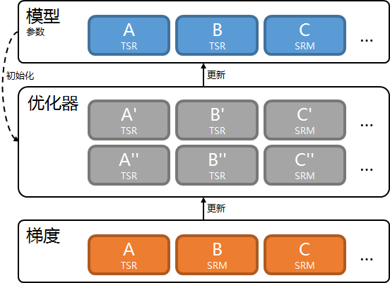

# 优化器

[TOC]

优化器通常包含参数.

优化器需要用计算图和模型参数初始化优化器参数. 优化器参数和模型参数对应.

优化器接收梯度, 应用具体的优化算法, 更新模型参数和优化器参数.



内置优化器可以满足绝大部分需求. 如果无法满足, 需要开发优化器.

## 内置优化器

大部分deepx程序中, 和优化器相关的参数有以下2个.

```shell
--optimizer=name --optimizer_config=config
```

name是优化器名称, 它可以是.

- adadelta<sup>1</sup>.
- adagrad<sup>2</sup>.
- adam<sup>3</sup>.
- ftrl<sup>4</sup>.
- gftrl<sup>5</sup>.
- hybrid.
- hybrid2.
- momentum<sup>6</sup>.
- rmsprop.
- sgd.

config是优化器配置, 它的格式是"配置名=值;配置名=值".

配置因优化器而异, 下面说明每个优化器的配置.

### adadelta

#### 配置

| 配置名 | 默认值 | 含义 | 合法取值范围 |
| - | - | - | - |
| rho | 0.95 | 累计梯度平方和衰减系数 | (0, 1] |
| alpha | 1 | 学习率 | (0, +∞) |
| beta | 1e-5 | 平滑项 | (0, +∞) |

#### 例子

```shell
--optimizer=adadelta --optimizer_config="rho=0.95;alpha=1;beta=1e-5"
```

### adagrad

#### 配置

| 配置名 | 默认值 | 含义 | 合法取值范围 |
| - | - | - | - |
| alpha | 0.01 | 学习率 | (0, +∞) |
| beta | 1e-5 | 平滑项 | (0, +∞) |

#### 例子

```shell
--optimizer=adagrad --optimizer_config="alpha=0.01;beta=1e-5"
```

### adam

#### 配置

| 配置名 | 默认值 | 含义 | 合法取值范围 |
| - | - | - | - |
| rho1 | 0.9 | 累计梯度衰减系数 | (0, 1] |
| rho2 | 0.999 | 累计梯度平方和衰减系数 | (0, 1] |
| alpha | 0.001 | 学习率 | (0, +∞) |
| beta | 1e-5 | 平滑项 | (0, +∞) |

#### 例子

```shell
--optimizer=adam --optimizer_config="rho1=0.9;rho2=0.999;alpha=0.001;beta=1e-5"
```

### ftrl

#### 配置

| 配置名 | 默认值 | 含义 | 合法取值范围 |
| - | - | - | - |
| alpha | 0.01 | 学习率 | (0, +∞) |
| beta | 1 | 平滑项 | (0, +∞) |
| l1 | 1 | L1惩罚系数 | [0, +∞) |
| l2 | 0 | L2惩罚系数 | [0, +∞) |

#### 例子

```shell
--optimizer=ftrl --optimizer_config="alpha=0.01;beta=1;l1=1;l2=0"
```

### gftrl

#### 配置

| 配置名 | 默认值 | 含义 | 合法取值范围 |
| - | - | - | - |
| alpha | 0.1 | 学习率 | (0, +∞) |
| beta | 0.01 | 平滑项 | (0, +∞) |
| lambda | 1e-4 | 惩罚系数 | (0, +∞) |

#### 例子

```shell
--optimizer=gftrl --optimizer_config="alpha=0.1;beta=0.01;lambda=1e-4"
```

### hybrid

混合优化器, 对不同模型参数使用不同优化器.
- TSR, adagrad优化器.
- 形如(?, 1)的SRM, ftrl优化器.
- 其它SRM, adagrad优化器.

#### 配置

| 配置名 | 默认值 | 含义/合法取值范围 |
| - | - | - |
| ada\_grad\_alpha | 0.01 | 同adagrad优化器的alpha |
| ada\_grad\_beta | 1e-5 | 同adagrad优化器的beta |
| ftrl\_alpha | 0.01 | 同ftrl优化器的alpha |
| ftrl\_beta | 1 | 同ftrl优化器的beta |
| ftrl\_l1 | 1 | 同ftrl优化器的l1 |
| ftrl\_l2 | 0 | 同ftrl优化器的l2 |

#### 例子

```shell
--optimizer=hybrid --optimizer_config="ada_grad_alpha=0.01;ada_grad_beta=1e-5;ftrl_alpha=0.01;ftrl_beta=1;ftrl_l1=1;ftrl_l2=0"
```

### hybrid2

混合优化器, 对不同模型参数使用不同优化器.
- TSR, adagrad优化器.
- SRM, gftrl优化器.

#### 配置

| 配置名 | 默认值 | 含义/合法取值范围 |
| - | - | - |
| ada\_grad\_alpha | 0.01 | 同adagrad优化器的alpha |
| ada\_grad\_beta | 1e-5 | 同adagrad优化器的beta |
| gftrl\_alpha | 0.01 | 同gftrl优化器的alpha |
| gftrl\_beta | 1 | 同gftrl优化器的beta |
| gftrl\_lambda | 1 | 同gftrl优化器的lambda |

#### 例子

```shell
--optimizer=hybrid --optimizer_config="ada_grad_alpha=0.01;ada_grad_beta=1e-5;gftrl_alpha=0.01;gftrl_beta=1;gftrl_lambda=1"
```

### momentum

#### 配置

| 配置名 | 默认值 | 含义 | 合法取值范围 |
| - | - | - | - |
| rho | 0.5 | 衰减系数 | (0, 1] |
| alpha | 0.1 | 学习率 | (0, +∞) |

#### 例子

```shell
--optimizer=momentum --optimizer_config="rho=0.5;alpha=0.1"
```

### rmsprop

#### 配置

| 配置名 | 默认值 | 含义 | 合法取值范围 |
| - | - | - | - |
| rho | 0.5 | 累计梯度平方和衰减系数 | (0, 1] |
| alpha | 0.1 | 学习率 | (0, +∞) |
| beta | 1e-5 | 平滑项 | (0, +∞) |

#### 例子

```shell
--optimizer=rmsprop --optimizer_config="rho=0.5;alpha=0.1;beta=1e-5"
```

### sgd

#### 配置

| 配置名 | 默认值 | 含义 | 合法取值范围 |
| - | - | - | - |
| alpha | 0.01 | 学习率 | (0, +∞) |
| min\_alpha | 1e-6 | 学习率衰减相关 | (0, +∞) |
| batch\_decay | 128 | 学习率衰减相关 | 非负整数 |
| batch\_decay\_rate | 0.95 | 学习率衰减相关 | (0, 1] |

学习率衰减.

- 学习率初始是alpha.
- 如果batch\_decay是0, 不进行衰减.
- 如果batch\_decay不是0, 每训练batch\_decay个batch样本, 学习率衰减为之前的batch\_decay\_rate, 学习率的下限是min\_alpha.

#### 例子

```shell
--optimizer=sgd --optimizer_config="alpha=0.01;min_alpha=1e-6;batch_decay=128;batch_decay_rate=0.95"
```

## 梯度裁剪

梯度输入给优化器前, 将被裁剪到[-20, 20].

## 优化器开发

通过继承增加新优化器.

优化器的头文件是["optimizer.h"](../include/deepx_core/graph/optimizer.h)和["optimizer\_impl.h"](../include/deepx_core/graph/optimizer_impl.h).

```c++
class Optimizer : public DataType {
 public:
  virtual ~Optimizer() = default;
  virtual const char* class_name() const noexcept = 0;
  virtual void Init(const Graph* graph, TensorMap* param) = 0;
  virtual bool InitConfig(const AnyMap& config) = 0;
  virtual bool InitConfig(const StringMap& config) = 0;
  virtual bool InitParam() = 0;
  virtual void InitLock(AnyMap* param_lock) = 0;
  virtual bool Write(OutputStream& os) const = 0;  // NOLINT
  virtual bool Read(InputStream& is) = 0;          // NOLINT
  virtual bool Merge(Optimizer* other, const Shard* shard = nullptr,
                     int shard_id = 0) = 0;

 public:
  // thread safe after 'InitLock'
  virtual void Update(TensorMap* grad) = 0;
  virtual void ForEachSRM(
      const std::function<void(const std::string&, srm_t*)>& func) = 0;
};

#define OPTIMIZER_REGISTER(class_name, name) ...
```

Optimizer是优化器的基类, 它定义了以下接口.

- class\_name, 返回类名.
- Init, 设置计算图和模型参数.
- InitConfig, 初始化配置, 返回是否成功.
- InitParam, 初始化优化器参数, 返回是否成功.
- InitLock, 初始化锁.
- Write, 写入优化器, 返回是否成功.
- Read, 读取优化器, 返回是否成功.
- Merge, 合并优化器参数.
- Update, 用梯度更新模型参数和优化器参数.
- ForEachSRM, 遍历SRM优化器参数.

子类实现以上接口时有以下注意事项.

- 根据模型参数和优化器参数的对应关系, 实现了以下基类, 优先考虑继承它们.
  - OptimizerBase0, 无优化器参数, 例如SGDOptimizer.
  - OptimizerBase1, 1个模型参数对应1个优化器参数, 例如AdaGradOptimizer.
  - OptimizerBase2, 1个模型参数对应2个优化器参数, 例如FTRLOptimizer.

用OPTIMIZER\_REGISTER宏注册优化器类和优化器名称.

之后, 可以像使用内置优化器一样使用它们.

### 例子

参考["optimizer"](../src/graph/optimizer).

## 参考文献

1. Zeiler, Matthew D. "Adadelta: an adaptive learning rate method." *arXiv preprint arXiv:1212.5701* (2012).
2. Duchi, John, Elad Hazan, and Yoram Singer. "Adaptive subgradient methods for online learning and stochastic optimization." *Journal of machine learning research* 12.7 (2011).
3. Kingma, Diederik P., and Jimmy Ba. "Adam: A method for stochastic optimization." *arXiv preprint arXiv:1412.6980* (2014).
4. McMahan, H. Brendan, et al. "Ad click prediction: a view from the trenches." *Proceedings of the 19th ACM SIGKDD international conference on Knowledge discovery and data mining*. 2013.
5. Ni, Xiuyan, et al. "Feature Selection for Facebook Feed Ranking System via a Group-Sparsity-Regularized Training Algorithm." *Proceedings of the 28th ACM International Conference on Information and Knowledge Management*. 2019.
6. Sutskever, Ilya, et al. "On the importance of initialization and momentum in deep learning." *International conference on machine learning*. 2013.
